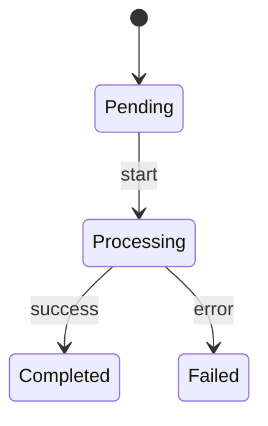

---
paths:
  - "docs/**/*.md"
  - "**/STATE-MACHINES.md"
  - "**/USECASES.md"
  - "**/MESSAGE-FLOWS.md"
---

# Living Documentation

## Update Triggers

**STATE-MACHINES.md** — Update in same commit when:
- State transitions change
- New events are added/removed
- Worker behavior changes
- New stateful components introduced
- Error handling or retry logic changes
- Timing/polling constants change

**USECASES.md** — Update in same commit when:
- Use cases are added/removed/renamed
- A use case's write/vector/event characteristics change
- File locations change

**MESSAGE-FLOWS.md** — Update in same commit when:
- Events are added/removed/renamed
- Event handlers are added/removed
- Cross-module flows change
- New subscribers are wired

## Diagram Format

Use Mermaid for all diagrams:

## Non-Negotiable Rule

Failing to update these docs is equivalent to failing to write tests — the work is not complete until the docs reflect the code.
