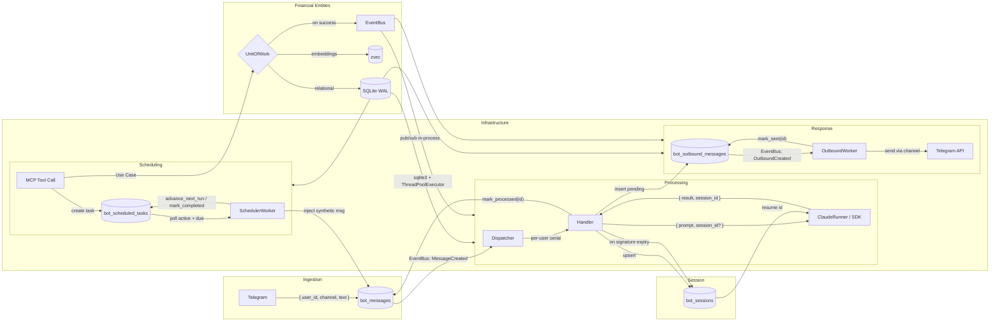
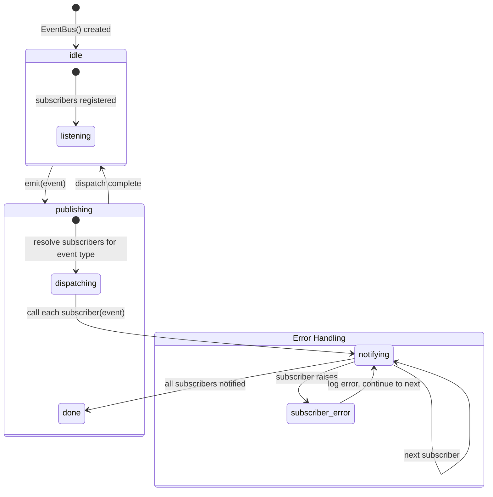
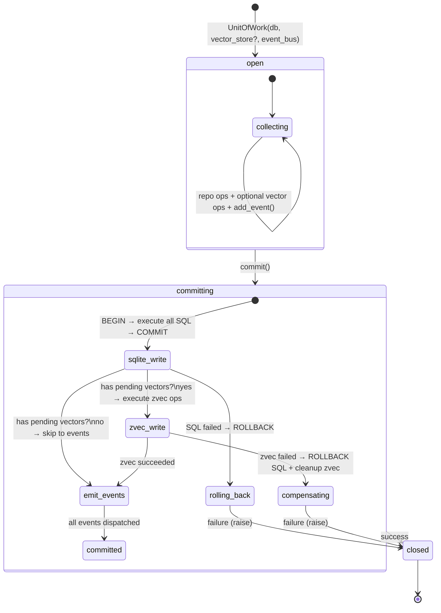
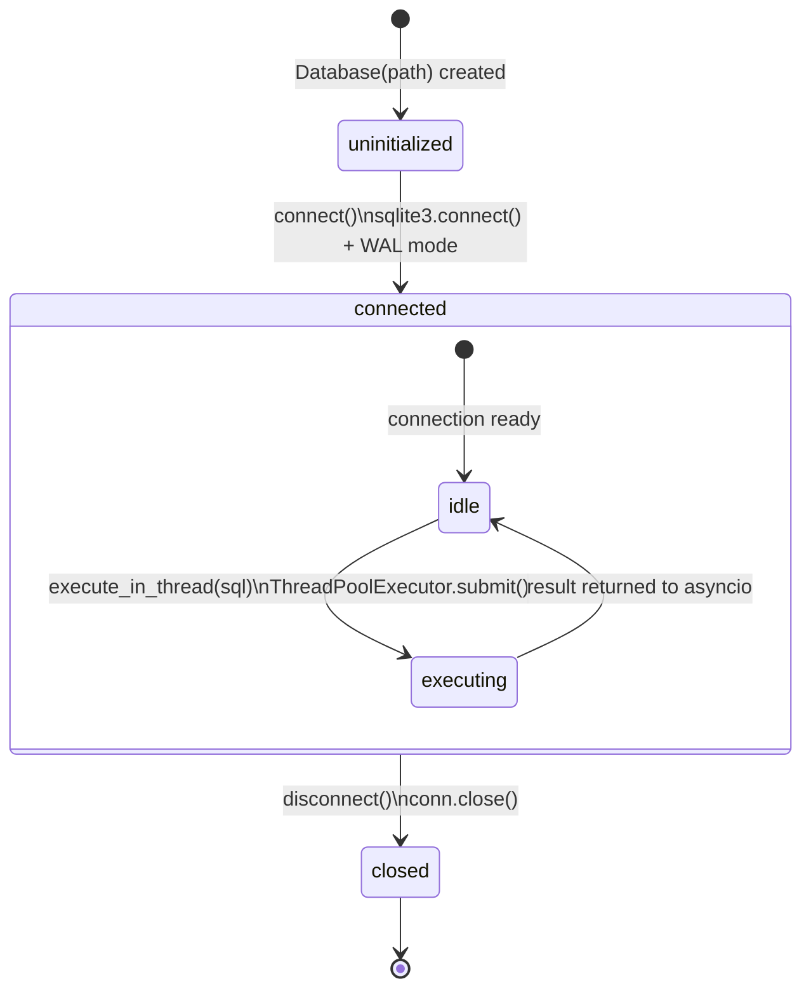
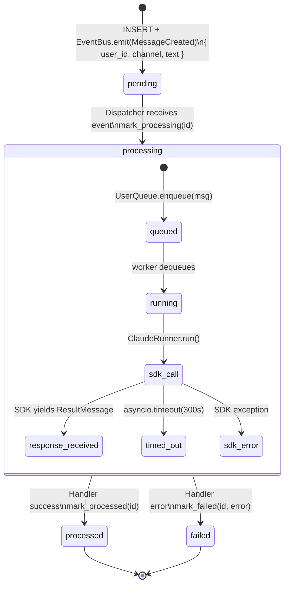
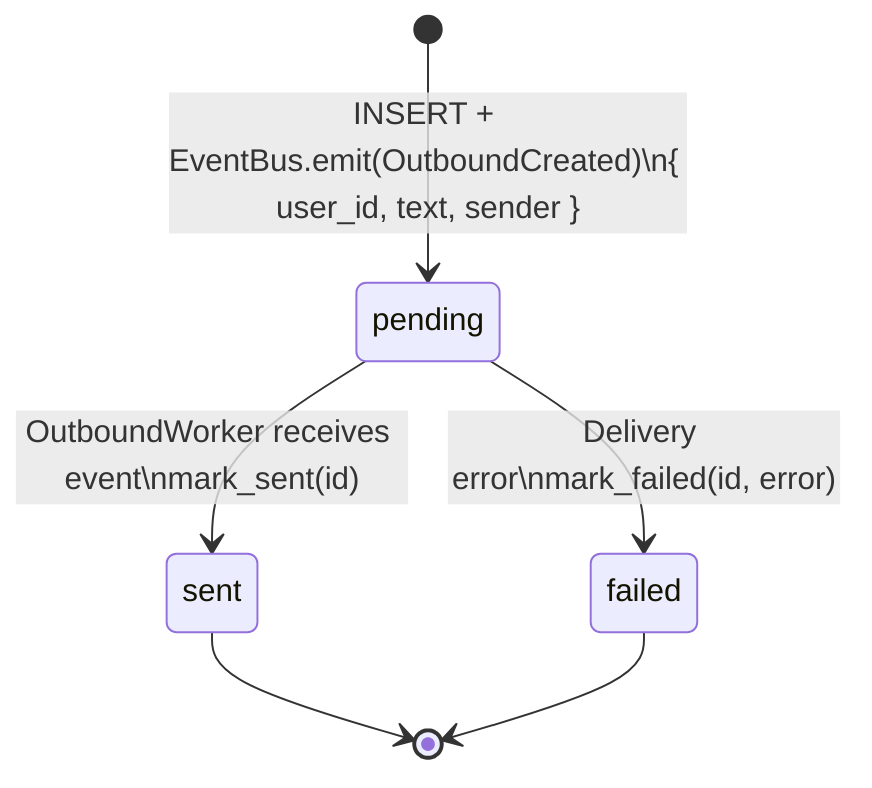
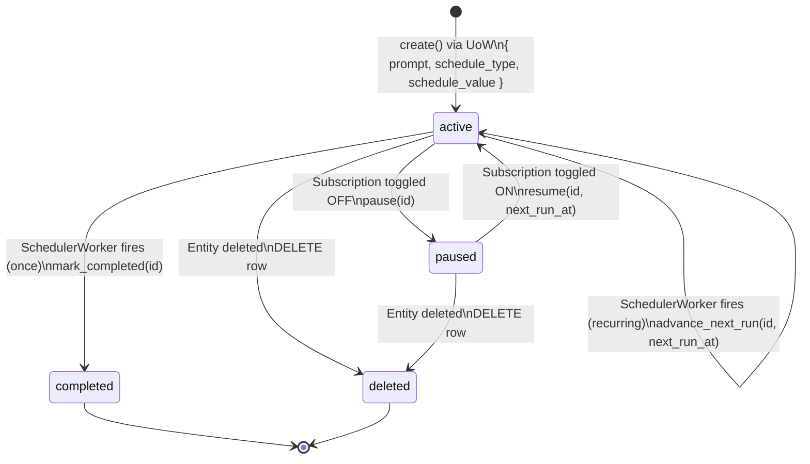
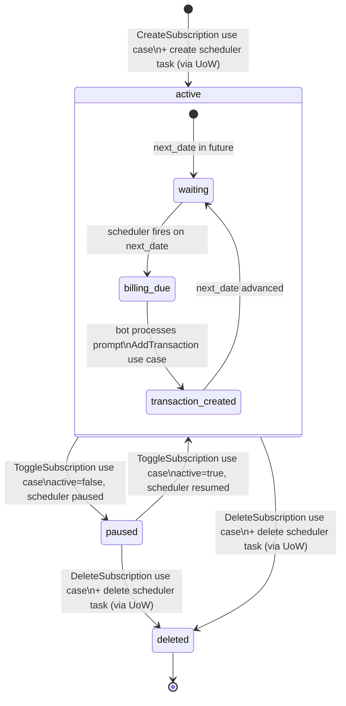
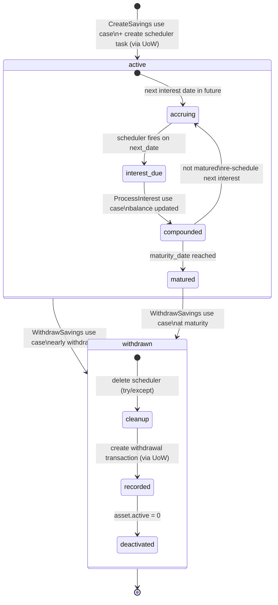
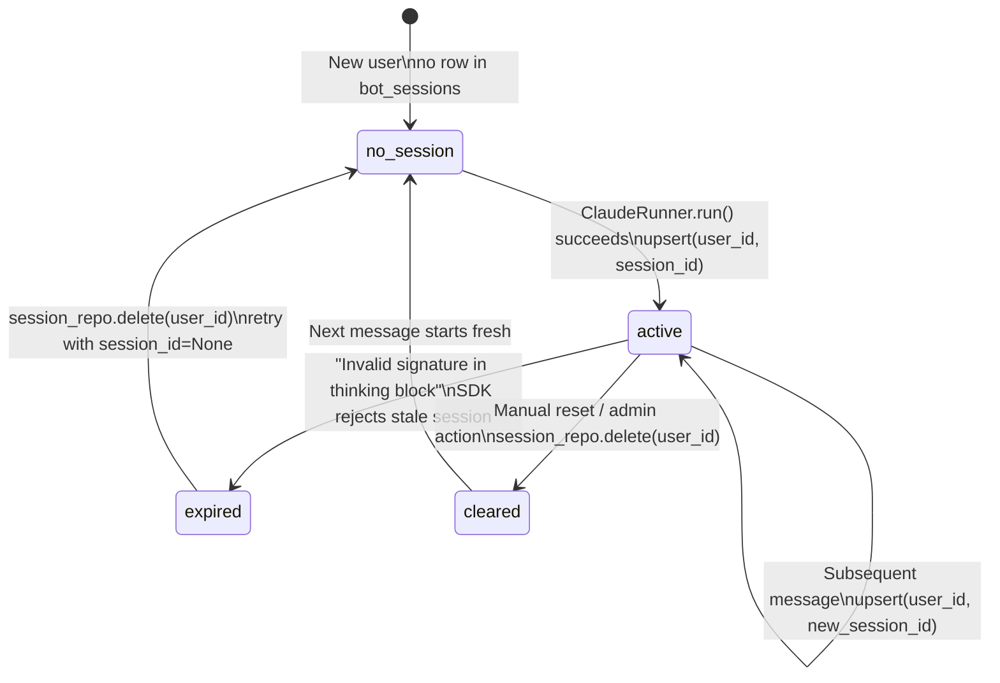

# Backend State Machine Diagrams

This document describes the state machines, data contracts, and dataflow for all stateful backend components in FluxFinance.

---

## End-to-End System Flow

How all backend systems connect — from user message to response delivery.



### Dataflow Summary

| Path | Input | Transform | Output |
|------|-------|-----------|--------|
| User → bot_messages | `{ user_id: str, channel: str, text: str }` | INSERT with `status='pending'` + EventBus.emit(MessageCreated) | `{ id: int, status: 'pending', created_at: str }` |
| MessageCreated → Dispatcher | Event: `{ message_id: int, user_id: str }` | Route to per-user queue, invoke ClaudeRunner | `{ result: str, session_id: str }` |
| Handler → bot_outbound | `{ user_id, text, sender }` | INSERT with `status='pending'` + EventBus.emit(OutboundCreated) | `{ id, status: 'pending' }` |
| OutboundCreated → Worker | Event: `{ outbound_id: int, user_id: str }` | Resolve channel handler, send | `{ status: 'sent' }` or `{ status: 'failed', error }` |
| MCP → Use Case → UoW | `{ user_id, data, embedding? }` | SQLite write + zvec write (if embedding) + emit events | `{ model }` |
| MCP → scheduled_tasks | `{ prompt, schedule_type, schedule_value }` | INSERT with `status='active'` via UoW | `{ id, next_run_at: str }` |
| SchedulerWorker → bot_messages | `{ user_id, prompt }` | Inject synthetic message via UoW + emit MessageCreated | Re-enters Processing pipeline |

---

## 1. Event Bus

In-process pub/sub replacing PostgreSQL LISTEN/NOTIFY.



### Event Types

| Event | Trigger | Fields | Subscribers |
|-------|---------|--------|-------------|
| `MessageCreated` | bot_messages INSERT | `message_id: int, user_id: str` | Dispatcher |
| `OutboundCreated` | bot_outbound INSERT | `outbound_id: int, user_id: str` | OutboundWorker |
| `TransactionCreated` | UoW commit | `transaction_id: str, user_id: str` | (future) |
| `TransactionUpdated` | UoW commit | `transaction_id: str, user_id: str` | (future) |
| `TransactionDeleted` | UoW commit | `transaction_id: str, user_id: str` | (future) |
| `MemoryCreated` | UoW commit | `memory_id: str, user_id: str` | (future) |
| `ScheduledTaskCreated` | UoW commit | `task_id: int, user_id: str` | (future) |
| `ScheduledTaskDue` | Scheduler fires | `task_id: int, user_id: str` | (future) |

### Design Decisions

- Subscribers are `async` callables
- One subscriber failure doesn't block others (error logged, continues)
- No persistence — fire-and-forget in-process signals
- No ordering guarantees between subscribers of the same event
- Thread-safe via asyncio (all emit/subscribe on the event loop)

---

## 2. Unit of Work

Dual-write coordinator for SQLite + zvec with event emission.



### Transition Table

| Transition | Trigger | Side Effects |
|------------|---------|--------------|
| `[*] → open` | `UnitOfWork()` created | SQLite `BEGIN` deferred. Repos bound to UoW's connection. |
| `collecting → collecting` | `repo.create(model)`, `add_vector(...)`, `add_event(...)` | Operations buffered. No I/O yet for vectors/events. SQL executes against the open transaction. |
| `open → committing` | `uow.commit()` | Starts the commit sequence. |
| `sqlite_write` | Execute all SQL in transaction | `COMMIT` the SQLite transaction. |
| `zvec_write` | Execute all zvec upserts | `collection.upsert(doc)` for each pending vector. |
| `emit_events` | Emit domain events | `event_bus.emit(event)` for each pending event. |
| `zvec_write → compensating` | zvec raises | Rollback SQLite (re-execute inverse ops). Attempt `collection.delete(id)` for any zvec docs already written. Raise original error. |
| `sqlite_write → rolling_back` | SQL raises | `ROLLBACK`. No zvec writes attempted. Raise original error. |

### Key Invariant

Events are only emitted after BOTH writes succeed. Consumers never see partial state.

---

## 3. Database Connection

SQLite via `sqlite3` + `ThreadPoolExecutor`, replacing asyncpg connection pool.



### Transition Table

| Transition | Trigger | Side Effects |
|------------|---------|--------------|
| `[*] → uninitialized` | `Database(path)` | Path stored. No connection yet. |
| `uninitialized → connected` | `connect()` | `sqlite3.connect(path)`, PRAGMAs: `journal_mode=WAL`, `foreign_keys=ON`, `busy_timeout=5000`, `synchronous=NORMAL`, `cache_size=-8000` |
| `idle → executing` | `execute()` / `fetch()` | Runs SQL in `ThreadPoolExecutor` to avoid blocking asyncio loop |
| `connected → closed` | `disconnect()` | `conn.close()` |

### Instances

| Component | Init Strategy |
|-----------|---------------|
| API Server | Lazy on first request |
| MCP Server | Lazy on first tool call |
| Agent Bot | Eager on startup |
| Entrypoint | Shared instance passed to all components |

---

## 4. Inbound Message Pipeline

Messages from external channels flow through event-driven dispatch, queuing, and processing.



### Transition Table

| Transition | Trigger | Input Schema | Side Effects | Output Schema |
|------------|---------|--------------|--------------|---------------|
| `[*] → pending` | Channel handler (Telegram) | `{ user_id: str, channel: str, platform_id: str, text: str?, image_path: str? }` | INSERT into `bot_messages` via UoW. EventBus emits `MessageCreated`. | `{ id: int, status: 'pending', created_at: str }` |
| `pending → processing` | Dispatcher receives `MessageCreated` event | `{ message_id: int, user_id: str }` | UPDATE `status='processing'` | `{ id, status: 'processing' }` |
| `processing → processed` | Handler completes successfully | `{ id: int }` | UPDATE `status='processed'`, `processed_at`. May INSERT into `bot_outbound_messages` + emit `OutboundCreated`. May upsert `bot_sessions`. All via UoW. | `{ id, status: 'processed', processed_at: str }` |
| `processing → failed` | Handler raises or SDK errors | `{ id: int, error: str }` | UPDATE `status='failed'`, `error`, `processed_at`. On signature expiry: DELETE session, retry once. | `{ id, status: 'failed', error: str, processed_at: str }` |

### Dataflow: Processing Phase

```
EventBus emits MessageCreated { message_id, user_id }
        │
        ▼
Dispatcher subscribes → routes to UserQueue by user_id
        │
        ▼
    ┌─ UserQueue.enqueue(msg) ─┐
    │  route by user_id        │
    └──────────┬───────────────┘
               ▼
    ┌─ ClaudeRunner.run() ─────────────────────┐
    │  system_prompt: str (enriched w/ profile) │
    │  mcp_config: { --user-id injected }       │
    │  session_id: str? (from bot_sessions)     │
    └──────────┬───────────────────────────────┘
               ▼
    SDK yields: SystemMessage { data.session_id }
                ResultMessage { result, session_id, is_error }
               │
               ▼
    ┌─ Response routing (via UoW) ───────────────┐
    │  success → insert outbound + mark_processed │
    │  error   → mark_failed + maybe retry        │
    │  session → upsert bot_sessions              │
    │  events  → OutboundCreated emitted          │
    └─────────────────────────────────────────────┘
```

---

## 5. Outbound Message Delivery

Responses queued for delivery to external channels.



### Transition Table

| Transition | Trigger | Input Schema | Side Effects | Output Schema |
|------------|---------|--------------|--------------|---------------|
| `[*] → pending` | Handler inserts response via UoW | `{ user_id: str, text: str, sender: str? }` | INSERT into `bot_outbound_messages`. EventBus emits `OutboundCreated`. | `{ id: int, status: 'pending', created_at: str }` |
| `pending → sent` | OutboundWorker receives `OutboundCreated` event | `{ outbound_id: int, user_id: str }` | Parse `user_id` → `(channel, platform_id)`. Call `channel.send_message(platform_id, text)`. UPDATE `status='sent'`, `completed_at`. | `{ id, status: 'sent', completed_at: str }` |
| `pending → failed` | Channel send raises | `{ id: int, error: str }` | UPDATE `status='failed'`, `error`, `completed_at`. | `{ id, status: 'failed', error: str, completed_at: str }` |

---

## 6. Scheduled Tasks

Timed task execution for recurring financial operations.



### Transition Table

| Transition | Trigger | Input Schema | Side Effects | Output Schema |
|------------|---------|--------------|--------------|---------------|
| `[*] → active` | Use case creates subscription/savings via UoW | `{ user_id: str, prompt: str, schedule_type: 'once'\|'cron'\|'interval', schedule_value: str, subscription_id?: str, asset_id?: str }` | INSERT into `bot_scheduled_tasks` with `status='active'`, computed `next_run_at`. | `{ id: int, status: 'active', next_run_at: str }` |
| `active → active` | `SchedulerWorker._fire_task()` (recurring) | `{ id: int, schedule_type: 'cron', schedule_value: str }` | 1. INSERT synthetic `bot_message` via UoW + emit MessageCreated. 2. Compute next occurrence via `croniter`. 3. UPDATE `next_run_at`, `last_run_at`. | `{ id, next_run_at: str, last_run_at: str }` |
| `active → completed` | `SchedulerWorker._fire_task()` (one-shot) | `{ id: int, schedule_type: 'once' }` | 1. INSERT synthetic `bot_message` via UoW + emit MessageCreated. 2. UPDATE `status='completed'`, `last_run_at`. | `{ id, status: 'completed', last_run_at: str }` |
| `active → paused` | `ToggleSubscription` use case sets `active=false` | `{ subscription_id: str }` | UPDATE `status='paused'` WHERE `subscription_id` matches. Via UoW. | `{ id, status: 'paused' }` |
| `paused → active` | `ToggleSubscription` use case sets `active=true` | `{ subscription_id: str, next_run_at: str }` | UPDATE `status='active'`, `next_run_at` recomputed. Via UoW. | `{ id, status: 'active', next_run_at: str }` |
| `* → deleted` | Entity (subscription/savings) deleted via use case | `{ subscription_id?: str, asset_id?: str }` | DELETE FROM `bot_scheduled_tasks`. Via UoW. | (row removed) |

### Dataflow: Cron Computation

```
Subscription { cycle: 'monthly', next_date: '2026-04-15' }
        │
        ▼
_derive_cron(cycle, next_date)
        │  monthly → "0 0 {day} * *" → "0 0 15 * *"
        │  yearly  → "0 0 {day} {month} *" → "0 0 15 4 *"
        ▼
croniter("0 0 15 * *", now_in_user_tz).get_next(datetime)
        │
        ▼
next_run_at = result.isoformat()  →  stored in SQLite
```

---

## 7. Subscription Lifecycle

Full lifecycle of a recurring subscription with paired scheduler.



### Transition Table

| Transition | Trigger | Input Schema | Side Effects | Output Schema |
|------------|---------|--------------|--------------|---------------|
| `[*] → active` | `CreateSubscription` use case | `{ user_id: str, name: str, amount: Decimal, category: str, billing_cycle: 'monthly'\|'yearly', next_date: date }` | 1. INSERT `subscriptions`. 2. INSERT `bot_scheduled_tasks` (type='cron', paired via `subscription_id`). Both via UoW. | `{ id: str, name, amount, billing_cycle, next_date, active: true }` |
| `active → paused` | `ToggleSubscription` when currently active | `{ subscription_id: str }` | 1. UPDATE `subscriptions.active = 0`. 2. UPDATE `bot_scheduled_tasks.status = 'paused'`. Via UoW. | `{ id, active: false }` |
| `paused → active` | `ToggleSubscription` when currently paused | `{ subscription_id: str }` | 1. UPDATE `subscriptions.active = 1`. 2. UPDATE `bot_scheduled_tasks.status = 'active'`, recompute `next_run_at`. Via UoW. | `{ id, active: true }` |
| `* → deleted` | `DeleteSubscription` use case | `{ subscription_id: str, user_id: str }` | 1. DELETE `bot_scheduled_tasks` WHERE subscription_id. 2. DELETE `subscriptions` row. Via UoW. | (rows removed) |
| `waiting → billing_due` | Scheduler fires (cron matches) | `{ task.prompt: str }` | Inject synthetic `bot_message` via UoW + emit MessageCreated. | `{ bot_message.id: int }` |
| `billing_due → transaction_created` | Bot/Claude processes prompt | `{ subscription_id: str, amount: Decimal }` | `AddTransaction` use case (type='expense'). SQLite + zvec via UoW. | `{ transaction.id: str }` |
| `transaction_created → waiting` | Scheduler advances | `{ task_id: int }` | `advance_next_run()` with new cron-derived `next_run_at`. UPDATE `subscriptions.next_date`. | `{ next_date: str, next_run_at: str }` |

---

## 8. Savings Deposit Lifecycle

Term deposit with compound interest processing and early withdrawal support.



### Transition Table

| Transition | Trigger | Input Schema | Side Effects | Output Schema |
|------------|---------|--------------|--------------|---------------|
| `[*] → active` | `CreateSavings` use case | `{ user_id: str, name: str, amount: Decimal, interest_rate: Decimal, frequency: str, start_date: date, maturity_date: date }` | 1. INSERT `assets` (type='savings', active=1). 2. INSERT `bot_scheduled_tasks` (type='once', paired via `asset_id`). Via UoW. | `{ id: str, amount, interest_rate, maturity_date, active: true }` |
| `accruing → interest_due` | Scheduler fires (next_date reached) | `{ task.prompt: str, asset_id: str }` | Inject synthetic message via UoW + emit MessageCreated. If matured: append "This deposit matures today...". | `{ bot_message.id: int }` |
| `interest_due → compounded` | `ProcessInterest` use case | `{ asset_id: str, user_id: str }` | Compound interest: `new_balance = amount * (1 + rate/periods)`. UPDATE `assets.amount`. Via UoW. | `{ previous_balance, interest_earned, new_balance, matured: bool }` |
| `compounded → accruing` | Not matured, re-schedule | `{ asset_id: str, next_date: date }` | New `bot_scheduled_tasks` row (type='once') for next interest date. Via UoW. | `{ task.id: int, next_run_at: str }` |
| `compounded → matured` | `maturity_date <= next_date` | (implicit) | `mark_completed()` on scheduler task. | `{ matured: true }` |
| `active/matured → withdrawn` | `WithdrawSavings` use case | `{ asset_id: str, user_id: str }` | 1. Delete scheduler (try/except). 2. `AddTransaction` (type='income', amount=current_balance). 3. UPDATE `assets.active = 0`. All via UoW. | `{ withdrawn_amount, transaction_id: str }` |

### Dataflow: Compound Interest

```
Input: { asset_id, amount: 10000, rate: 0.05, frequency: 'monthly' }
                    │
                    ▼
        periods_per_year = { monthly: 12, quarterly: 4, yearly: 1 }
        period_rate = rate / periods_per_year
                    │
                    ▼
        interest_earned = amount * period_rate
        new_balance = amount + interest_earned
                    │  10000 * (0.05 / 12) = 41.67
                    │  10000 + 41.67 = 10041.67
                    ▼
        UPDATE assets SET amount = '10041.67'
        Output: { previous: 10000, earned: 41.67, new: 10041.67, matured: false }
```

---

## 9. Claude Session Management

Conversation session tracking with expiry recovery.



### Transition Table

| Transition | Trigger | Input Schema | Side Effects | Output Schema |
|------------|---------|--------------|--------------|---------------|
| `[*] → no_session` | First message from user | `{ user_id: str }` | `get_session_id()` returns `None`. | `session_id = None` |
| `no_session → active` | SDK returns `ResultMessage` | `{ user_id: str, session_id: str }` | `INSERT OR REPLACE INTO bot_sessions (user_id, session_id, updated_at)`. Via UoW. | `{ user_id, session_id, updated_at: str }` |
| `active → active` | Each successful SDK call | `{ user_id: str, session_id: str }` | `INSERT OR REPLACE` with new `session_id`. `updated_at` refreshed. | `{ session_id: str, updated_at: str }` |
| `active → expired` | SDK error containing "Invalid signature in thinking block" | `{ user_id: str, error: str }` | Error detected in handler. | (error state, about to recover) |
| `expired → no_session` | Automatic recovery | `{ user_id: str }` | `DELETE FROM bot_sessions WHERE user_id = ?`. Retry message with `session_id=None`. | (row removed, fresh start) |
| `active → cleared` | Manual/admin deletion | `{ user_id: str }` | `DELETE FROM bot_sessions WHERE user_id = ?`. | (row removed) |

### Dataflow: Session Resolution

```
Incoming message for user_id = "tg:12345"
        │
        ▼
session_repo.get_session_id("tg:12345")
        │
        ├── None → ClaudeRunner.run(session_id=None)
        │          └── SDK starts fresh conversation
        │
        └── "sess_abc123" → ClaudeRunner.run(session_id="sess_abc123")
                            └── SDK resumes conversation
        │
        ▼
SDK yields SystemMessage { data.session_id: "sess_def456" }
SDK yields ResultMessage { session_id: "sess_def456", result: "..." }
        │
        ▼
session_repo.upsert("tg:12345", "sess_def456") via UoW
        └── Next message will resume from "sess_def456"
```
