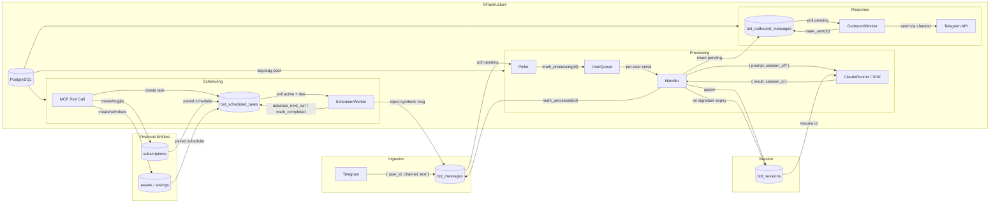
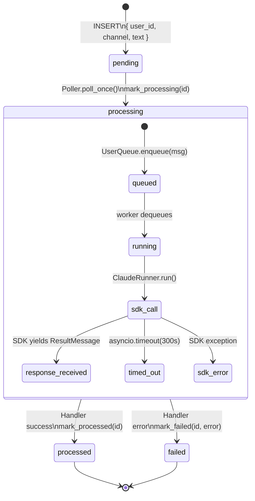
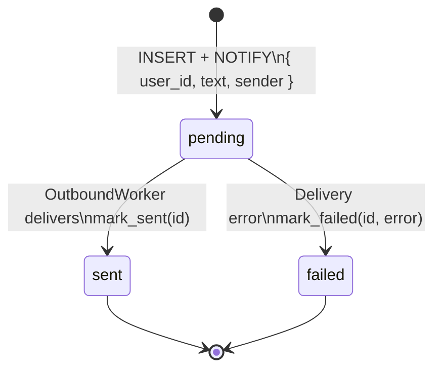
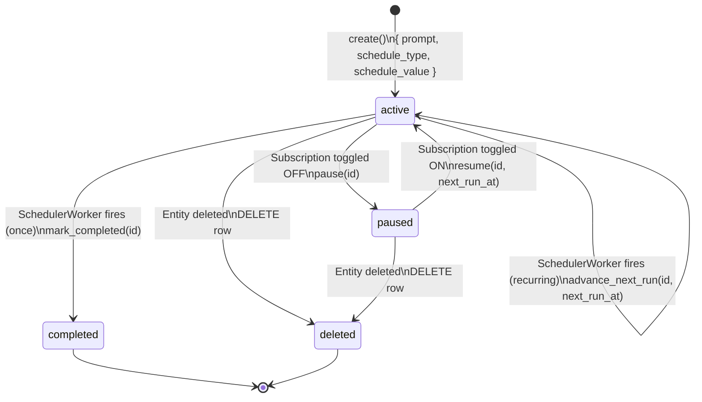
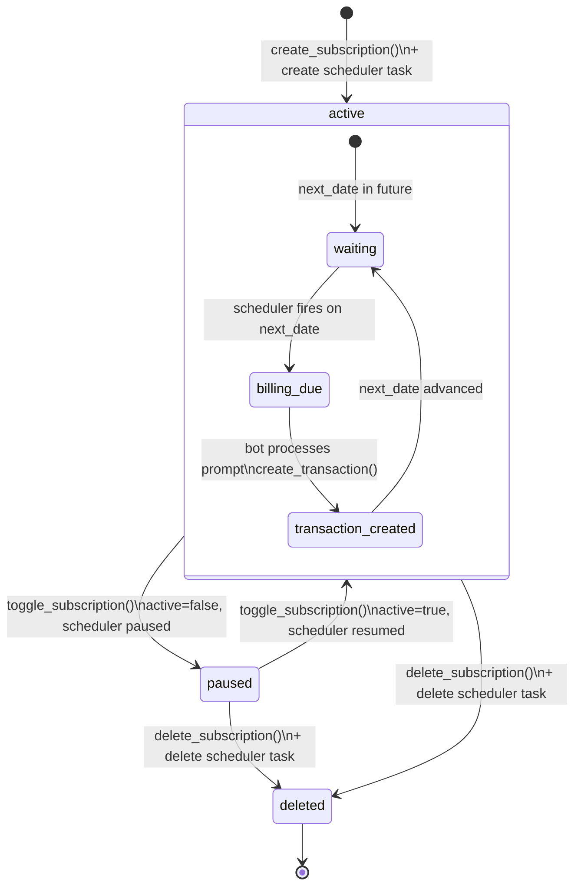
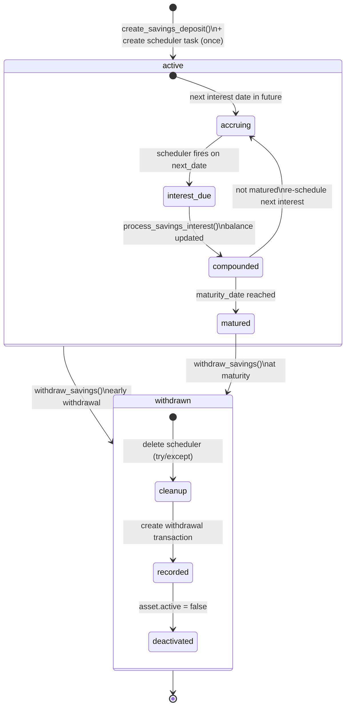
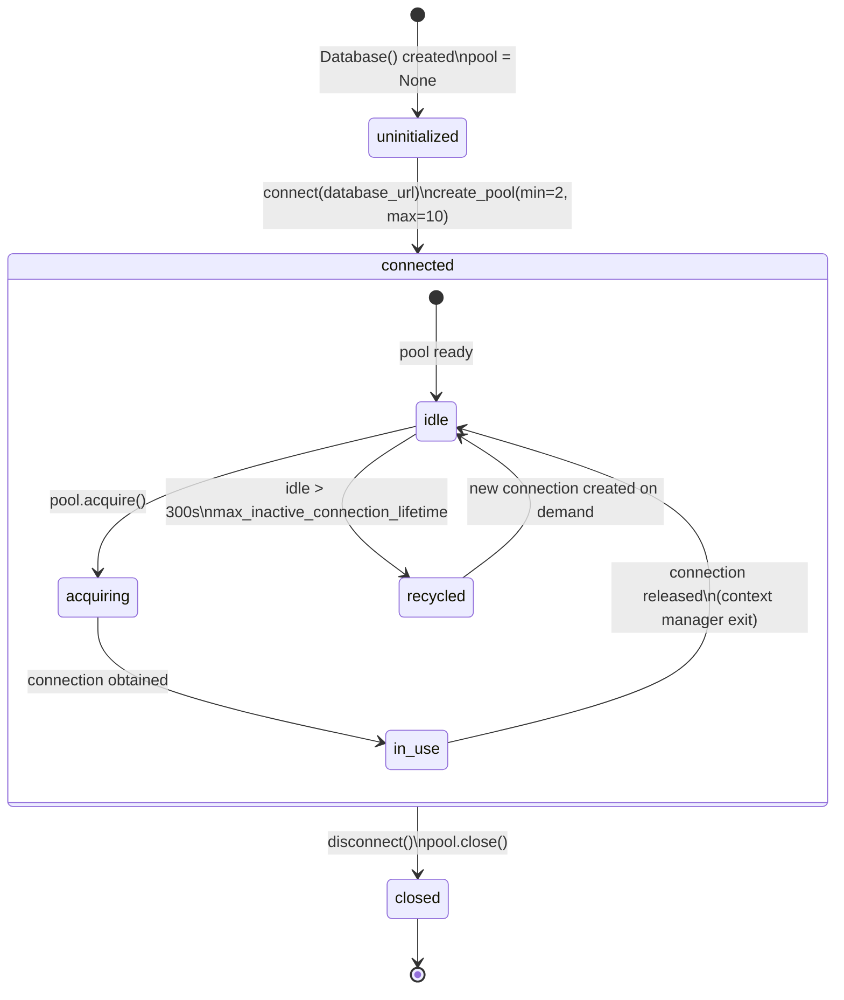
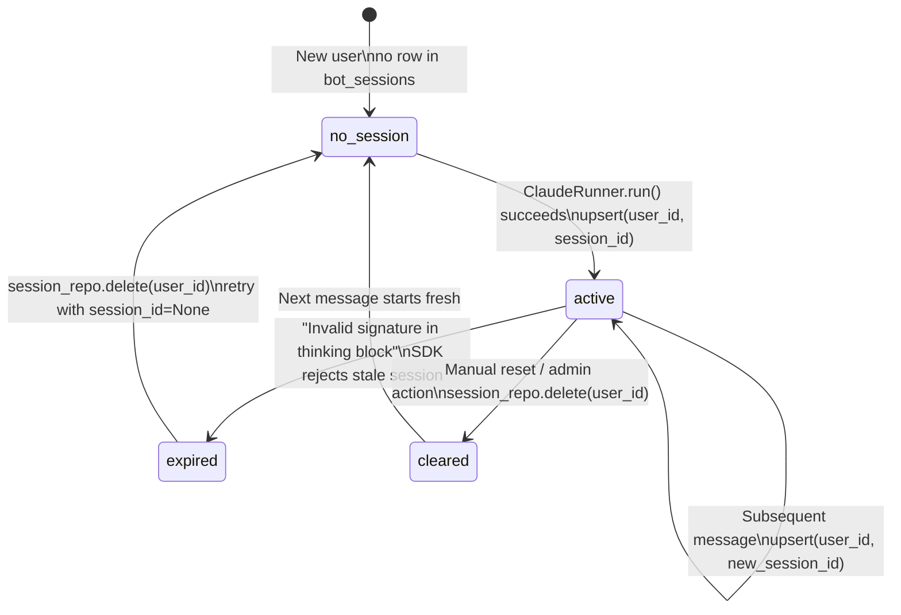

# Backend State Machine Diagrams

This document describes the state machines, data contracts, and dataflow for all stateful backend components in FluxFinance.

---

## End-to-End System Flow

How all backend systems connect — from user message to response delivery.



### Dataflow Summary

| Path | Input | Transform | Output |
|------|-------|-----------|--------|
| User → bot_messages | `{ user_id: str, channel: str, text: str }` | INSERT with `status='pending'` | `{ id: int, status: 'pending', created_at: timestamptz }` |
| bot_messages → Poller | `WHERE status='pending' ORDER BY created_at` | `mark_processing(id)` | `{ id, user_id, text, status: 'processing' }` |
| Poller → UserQueue → Handler | `{ id, user_id, text }` | Route to per-user queue, invoke ClaudeRunner | `{ result: str, session_id: str }` |
| Handler → bot_outbound | `{ user_id, text, sender }` | INSERT with `status='pending'`, NOTIFY trigger | `{ id, status: 'pending' }` |
| OutboundWorker → Channel | `{ user_id, text }` | Resolve channel handler, send | `{ status: 'sent' }` or `{ status: 'failed', error }` |
| MCP → scheduled_tasks | `{ prompt, schedule_type, schedule_value, subscription_id? }` | INSERT with `status='active'` | `{ id, next_run_at: timestamptz }` |
| SchedulerWorker → bot_messages | `{ user_id, prompt }` | Inject synthetic message | Re-enters Processing pipeline |

---

## 1. Inbound Message Pipeline

Messages from external channels flow through polling, queuing, and processing.



### Transition Table

| Transition | Trigger | Input Schema | Side Effects | Output Schema |
|------------|---------|--------------|--------------|---------------|
| `[*] → pending` | Channel handler (Telegram) | `{ user_id: str, channel: str, platform_id: str, text: str?, image_path: str? }` | INSERT into `bot_messages` | `{ id: int, status: 'pending', created_at: timestamptz }` |
| `pending → processing` | `Poller._poll_once()` (every 2-30s) | `{ id: int }` | UPDATE `status='processing'` | `{ id, status: 'processing' }` |
| `processing → processed` | Handler completes successfully | `{ id: int }` | UPDATE `status='processed'`, `processed_at=NOW()`. May INSERT into `bot_outbound_messages`. May upsert `bot_sessions`. | `{ id, status: 'processed', processed_at: timestamptz }` |
| `processing → failed` | Handler raises or SDK errors | `{ id: int, error: str }` | UPDATE `status='failed'`, `error=<reason>`, `processed_at=NOW()`. On signature expiry: DELETE session, retry once. | `{ id, status: 'failed', error: str, processed_at: timestamptz }` |

### Dataflow: Processing Phase

```
Input:  { id, user_id, channel, text }
                    │
                    ▼
        ┌─ UserQueue.enqueue(msg) ─┐
        │  route by user_id        │
        └──────────┬───────────────┘
                   ▼
        ┌─ ClaudeRunner.run() ─────────────────────┐
        │  system_prompt: str (enriched w/ profile) │
        │  mcp_config: { --user-id injected }       │
        │  session_id: str? (from bot_sessions)     │
        └──────────┬───────────────────────────────┘
                   ▼
        SDK yields: SystemMessage { data.session_id }
                    ResultMessage { result, session_id, is_error }
                    │
                    ▼
        ┌─ Response routing ───────────────────────┐
        │  success → insert outbound + mark_processed│
        │  error   → mark_failed + maybe retry      │
        │  session → upsert bot_sessions             │
        └──────────────────────────────────────────┘
```

---

## 2. Outbound Message Delivery

Responses queued for delivery to external channels.



### Transition Table

| Transition | Trigger | Input Schema | Side Effects | Output Schema |
|------------|---------|--------------|--------------|---------------|
| `[*] → pending` | Handler inserts response | `{ user_id: str, text: str, sender: str? }` | INSERT into `bot_outbound_messages`. PostgreSQL trigger fires `NOTIFY 'new_outbound_message'`. | `{ id: int, status: 'pending', created_at: timestamptz }` |
| `pending → sent` | `OutboundWorker._deliver_once()` | `{ id: int, user_id: str, text: str }` | Parse `user_id` → `(channel, platform_id)`. Call `channel.send_message(platform_id, text)`. UPDATE `status='sent'`, `completed_at=NOW()`. | `{ id, status: 'sent', completed_at: timestamptz }` |
| `pending → failed` | Channel send raises | `{ id: int, error: str }` | UPDATE `status='failed'`, `error=<reason>`, `completed_at=NOW()`. | `{ id, status: 'failed', error: str, completed_at: timestamptz }` |

### Dataflow: LISTEN/NOTIFY Wakeup

```
INSERT bot_outbound_messages
        │
        ├──► PostgreSQL trigger: trg_outbound_message
        │    └──► NOTIFY 'new_outbound_message'
        │
        ▼
OutboundWorker._listener_conn
        │
        └──► _on_notify() → _notify_event.set()
             └──► Main loop wakes immediately (vs 30s timeout)
```

---

## 3. Scheduled Tasks

Timed task execution for recurring financial operations.



### Transition Table

| Transition | Trigger | Input Schema | Side Effects | Output Schema |
|------------|---------|--------------|--------------|---------------|
| `[*] → active` | MCP tool creates subscription/savings | `{ user_id: str, prompt: str, schedule_type: 'once'\|'cron'\|'interval', schedule_value: str, subscription_id?: uuid, asset_id?: uuid }` | INSERT into `bot_scheduled_tasks` with `status='active'`, computed `next_run_at`. | `{ id: int, status: 'active', next_run_at: timestamptz }` |
| `active → active` | `SchedulerWorker._fire_task()` (recurring) | `{ id: int, schedule_type: 'cron', schedule_value: str }` | 1. INSERT synthetic `bot_message` with task prompt. 2. Compute next occurrence via `croniter`. 3. UPDATE `next_run_at`, `last_run_at=NOW()`. | `{ id, next_run_at: timestamptz, last_run_at: timestamptz }` |
| `active → completed` | `SchedulerWorker._fire_task()` (one-shot) | `{ id: int, schedule_type: 'once' }` | 1. INSERT synthetic `bot_message`. 2. UPDATE `status='completed'`, `last_run_at=NOW()`. | `{ id, status: 'completed', last_run_at: timestamptz }` |
| `active → paused` | `toggle_subscription()` sets `active=false` | `{ subscription_id: uuid }` | UPDATE `status='paused'` WHERE `subscription_id` matches. | `{ id, status: 'paused' }` |
| `paused → active` | `toggle_subscription()` sets `active=true` | `{ subscription_id: uuid, next_run_at: timestamptz }` | UPDATE `status='active'`, `next_run_at` recomputed from subscription.next_date. | `{ id, status: 'active', next_run_at: timestamptz }` |
| `* → deleted` | Entity (subscription/savings) deleted | `{ subscription_id?: uuid, asset_id?: uuid }` | DELETE FROM `bot_scheduled_tasks`. | (row removed) |

### Dataflow: Cron Computation

```
Subscription { cycle: 'monthly', next_date: '2026-04-15' }
        │
        ▼
_derive_cron(cycle, next_date)
        │  monthly → "0 0 {day} * *" → "0 0 15 * *"
        │  yearly  → "0 0 {day} {month} *" → "0 0 15 4 *"
        ▼
croniter("0 0 15 * *", now_in_user_tz).get_next(datetime)
        │
        ▼
next_run_at = result.astimezone(UTC)  →  stored in DB
```

---

## 4. Subscription Lifecycle

Full lifecycle of a recurring subscription with paired scheduler.



### Transition Table

| Transition | Trigger | Input Schema | Side Effects | Output Schema |
|------------|---------|--------------|--------------|---------------|
| `[*] → active` | `create_subscription_with_scheduler()` | `{ user_id: str, name: str, amount: Decimal, category: str, billing_cycle: 'monthly'\|'yearly', next_date: date }` | 1. INSERT `subscriptions` row. 2. INSERT `bot_scheduled_tasks` (type='cron', paired via `subscription_id`). | `{ id: uuid, name, amount, billing_cycle, next_date, active: true }` |
| `active → paused` | `toggle_subscription()` when currently active | `{ subscription_id: uuid }` | 1. UPDATE `subscriptions.active = false`. 2. UPDATE `bot_scheduled_tasks.status = 'paused'`. | `{ id, active: false }` |
| `paused → active` | `toggle_subscription()` when currently paused | `{ subscription_id: uuid }` | 1. UPDATE `subscriptions.active = true`. 2. UPDATE `bot_scheduled_tasks.status = 'active'`, recompute `next_run_at`. | `{ id, active: true }` |
| `* → deleted` | `delete_subscription_with_scheduler()` | `{ subscription_id: uuid, user_id: str }` | 1. DELETE `bot_scheduled_tasks` WHERE subscription_id. 2. DELETE `subscriptions` row. | (rows removed) |
| `waiting → billing_due` | Scheduler fires (cron matches) | `{ task.prompt: str }` | Inject synthetic `bot_message`: "Process subscription billing for {name} (id: {uuid})". | `{ bot_message.id: int }` |
| `billing_due → transaction_created` | Bot/Claude processes prompt | `{ subscription_id: uuid, amount: Decimal }` | `create_transaction(type='expense', amount, category, description)`. | `{ transaction.id: uuid }` |
| `transaction_created → waiting` | Scheduler advances | `{ task_id: int }` | `advance_next_run()` with new cron-derived `next_run_at`. UPDATE `subscriptions.next_date`. | `{ next_date: date, next_run_at: timestamptz }` |

---

## 5. Savings Deposit Lifecycle

Term deposit with compound interest processing and early withdrawal support.



### Transition Table

| Transition | Trigger | Input Schema | Side Effects | Output Schema |
|------------|---------|--------------|--------------|---------------|
| `[*] → active` | `create_savings_with_scheduler()` | `{ user_id: str, name: str, amount: Decimal, interest_rate: Decimal, frequency: 'monthly'\|'quarterly'\|'yearly', start_date: date, maturity_date: date }` | 1. INSERT `assets` (type='savings', active=true). 2. INSERT `bot_scheduled_tasks` (type='once', paired via `asset_id`). | `{ id: uuid, amount, interest_rate, maturity_date, active: true }` |
| `accruing → interest_due` | Scheduler fires (next_date reached) | `{ task.prompt: str, asset_id: uuid }` | Inject synthetic message: "Process savings interest for {name} (id: {uuid})". If matured: append "This deposit matures today...". | `{ bot_message.id: int }` |
| `interest_due → compounded` | `process_savings_interest()` | `{ asset_id: uuid, user_id: str }` | Compound interest: `new_balance = amount * (1 + rate/periods)`. UPDATE `assets.amount = new_balance`. | `{ previous_balance: Decimal, interest_earned: Decimal, new_balance: Decimal, matured: bool }` |
| `compounded → accruing` | Not matured, re-schedule | `{ asset_id: uuid, next_date: date }` | New `bot_scheduled_tasks` row (type='once') for next interest date. | `{ task.id: int, next_run_at: timestamptz }` |
| `compounded → matured` | `maturity_date <= next_date` | (implicit from interest processing) | `mark_completed()` on scheduler task. | `{ matured: true }` |
| `active/matured → withdrawn` | `withdraw_savings()` | `{ asset_id: uuid, user_id: str }` | 1. `scheduler_repo.delete(asset_id)` (try/except — proceeds on failure). 2. Record withdrawal transaction (type='income', amount=current_balance). 3. UPDATE `assets.active = false`. | `{ withdrawn_amount: Decimal, transaction_id: uuid }` |

### Dataflow: Compound Interest

```
Input: { asset_id, amount: 10000, rate: 0.05, frequency: 'monthly' }
                    │
                    ▼
        periods_per_year = { monthly: 12, quarterly: 4, yearly: 1 }
        period_rate = rate / periods_per_year
                    │
                    ▼
        interest_earned = amount * period_rate
        new_balance = amount + interest_earned
                    │  10000 * (0.05 / 12) = 41.67
                    │  10000 + 41.67 = 10041.67
                    ▼
        UPDATE assets SET amount = 10041.67
        Output: { previous: 10000, earned: 41.67, new: 10041.67, matured: false }
```

---

## 6. Database Connection Pool

asyncpg pool lifecycle for PostgreSQL connections.



### Transition Table

| Transition | Trigger | Input Schema | Side Effects | Output Schema |
|------------|---------|--------------|--------------|---------------|
| `[*] → uninitialized` | `Database(url)` constructor | `{ database_url: str }` | Instance created, `pool = None`. | `Database { pool: None }` |
| `uninitialized → connected` | `connect()` (lazy, on first use) | `{ min_size: 2, max_size: 10, max_inactive_connection_lifetime: 300 }` | `asyncpg.create_pool()`. Establishes `min_size` connections immediately. | `Database { pool: asyncpg.Pool }` |
| `idle → in_use` | `async with pool.acquire() as conn:` | (none — pool internal) | Connection checked out from pool. If all connections busy and `< max_size`, new one created. If at `max_size`, caller waits. | `asyncpg.Connection` |
| `in_use → idle` | Context manager `__aexit__` | (none) | Connection returned to pool. | (connection available for reuse) |
| `idle → recycled` | Pool maintenance timer | `{ idle_time > 300s }` | Connection closed, pool size decremented. New connection created on next `acquire()` if below `min_size`. | (connection destroyed) |
| `connected → closed` | `disconnect()` | (none) | `pool.close()` — closes all connections, sets `pool = None`. | `Database { pool: None }` |

### Pool Instances

| Component | Pool Location | Init Strategy |
|-----------|--------------|---------------|
| API Server | `flux_api.app._db` singleton | Lazy on first request |
| MCP Server | `flux_mcp.server._db` singleton | Lazy on first tool call |
| Agent Bot | `asyncpg.create_pool()` in main | Eager on startup (for bot tables) |

---

## 7. Claude Session Management

Conversation session tracking with expiry recovery.



### Transition Table

| Transition | Trigger | Input Schema | Side Effects | Output Schema |
|------------|---------|--------------|--------------|---------------|
| `[*] → no_session` | First message from user | `{ user_id: str }` | `get_session_id()` returns `None`. | `session_id = None` |
| `no_session → active` | SDK returns `ResultMessage` | `{ user_id: str, session_id: str }` | `INSERT INTO bot_sessions (user_id, session_id) ON CONFLICT (user_id) DO UPDATE`. | `{ user_id, session_id, updated_at: timestamptz }` |
| `active → active` | Each successful SDK call | `{ user_id: str, session_id: str }` | Upsert with new `session_id` (may differ from previous). `updated_at` refreshed. | `{ session_id: str, updated_at: timestamptz }` |
| `active → expired` | SDK error containing "Invalid signature in thinking block" | `{ user_id: str, error: str }` | Error detected in handler. | (error state, about to recover) |
| `expired → no_session` | Automatic recovery | `{ user_id: str }` | `DELETE FROM bot_sessions WHERE user_id = $1`. Retry message with `session_id=None`. | (row removed, fresh start) |
| `active → cleared` | Manual/admin deletion | `{ user_id: str }` | `DELETE FROM bot_sessions WHERE user_id = $1`. | (row removed) |

### Dataflow: Session Resolution

```
Incoming message for user_id = "tg:12345"
        │
        ▼
session_repo.get_session_id("tg:12345")
        │
        ├── None → ClaudeRunner.run(session_id=None)
        │          └── SDK starts fresh conversation
        │
        └── "sess_abc123" → ClaudeRunner.run(session_id="sess_abc123")
                            └── SDK resumes conversation
        │
        ▼
SDK yields SystemMessage { data.session_id: "sess_def456" }
SDK yields ResultMessage { session_id: "sess_def456", result: "..." }
        │
        ▼
session_repo.upsert("tg:12345", "sess_def456")
        └── Next message will resume from "sess_def456"
```
