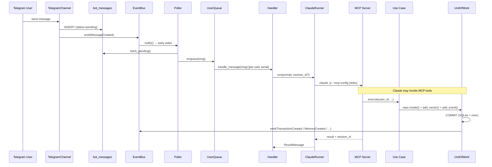
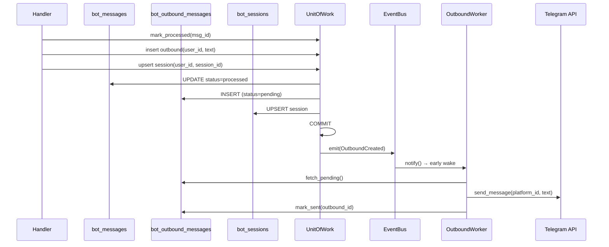
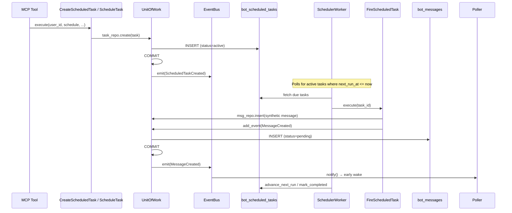
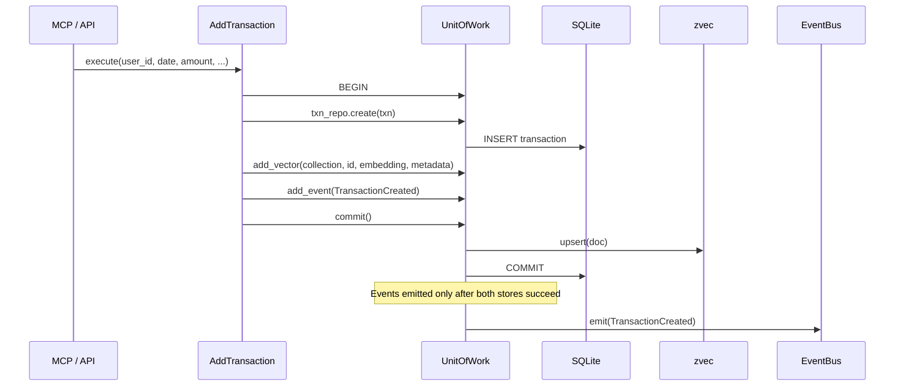
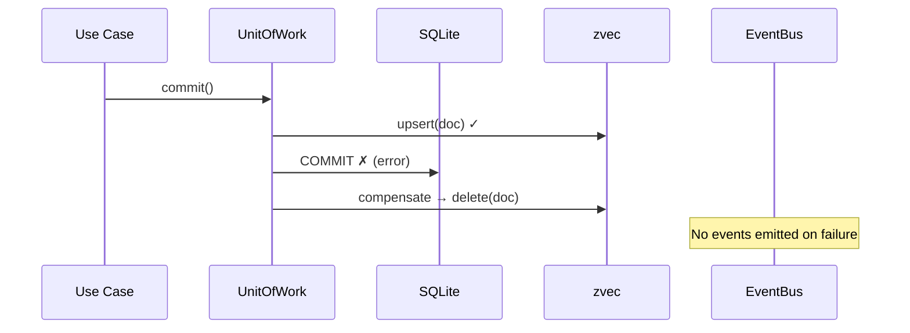
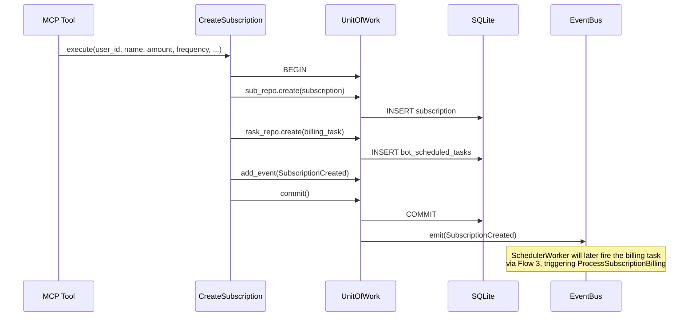
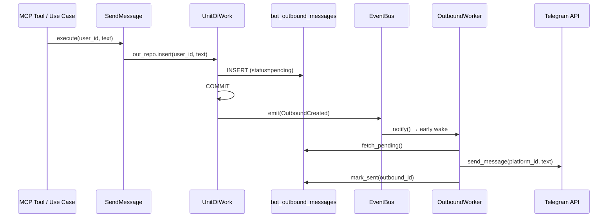

# Message Flows

Living document — cross-module event flows in FluxFinance. Each diagram shows the command → event → handler chain when an action in one module triggers behavior in another via the EventBus.

**Update rule:** When you add, remove, or change an event emission or event handler, update this doc in the same commit.

---

## Event Inventory

| Event                  | Emitted By                                   | Consumed By                        |
| ---------------------- | -------------------------------------------- | ---------------------------------- |
| `MessageCreated`       | TelegramChannel, `FireScheduledTask`         | Poller (notify → early wake)       |
| `OutboundCreated`      | `ProcessMessage`, `SendMessage`              | OutboundWorker (notify → delivery) |
| `TransactionCreated`   | `AddTransaction`                             | *(future subscribers)*             |
| `TransactionUpdated`   | `UpdateTransaction`                          | *(future subscribers)*             |
| `TransactionDeleted`   | `DeleteTransaction`                          | *(future subscribers)*             |
| `MemoryCreated`        | `Remember`                                   | *(future subscribers)*             |
| `SubscriptionCreated`  | `CreateSubscription`                         | *(future subscribers)*             |
| `SavingsCreated`       | `CreateSavings`                              | *(future subscribers)*             |
| `ScheduledTaskCreated` | `CreateScheduledTask`, `ScheduleTask`        | *(future subscribers)*             |
| `ScheduledTaskDue`     | *(not yet emitted — reserved for future use)* | *(future subscribers)*            |

---

## Flow 1 — Telegram Message → AI Response

The primary end-to-end flow: user sends a Telegram message, the agent processes it via Claude + MCP tools, and the response is delivered back.

---

## Flow 2 — Response Delivery (OutboundCreated)

After the handler receives Claude's response, it stores the outbound message and triggers delivery.

---

## Flow 3 — Scheduled Task Firing (ScheduledTaskCreated → MessageCreated)

MCP tools create scheduled tasks (subscriptions, savings, reminders). The SchedulerWorker polls for due tasks and injects synthetic messages that re-enter the main message flow.

---

## Flow 4 — Financial Entity Write (Transaction Example)

All write use cases follow the same UoW pattern: SQLite write → zvec write (if embeddings) → COMMIT → emit events.

**Failure / compensation:**

---

## Flow 5 — Subscription / Savings Creation (Multi-Table + Scheduled Task)

Creating a subscription or savings asset writes to two tables and creates a scheduled task in the same UoW transaction.

---

## Flow 6 — SendMessage (Proactive Outbound)

Use cases or MCP tools can proactively send messages to users (not in response to an inbound message).

---

## Event Emission Invariants

1. **Events emit only after successful commit** — UoW emits `_pending_events` only after both SQLite COMMIT and zvec writes succeed.
2. **One failure does not block other subscribers** — EventBus catches and logs subscriber errors, then continues to remaining handlers.
3. **No persistence or replay** — events are fire-and-forget in-process signals. If a subscriber is down when the event fires, the event is lost (polling provides the fallback).
4. **Polling as safety net** — Poller and OutboundWorker poll on intervals regardless of events. `notify()` from EventBus provides early wake for lower latency, but correctness does not depend on it.
5. **No ordering guarantees** — multiple subscribers for the same event type may execute in any order.
