# Backend State Machine Diagrams

This living document describes the state machines, data contracts, and dataflow for all stateful backend components in FluxFinance.

---

## End-to-End System Flow

How all backend systems connect — from user message to response delivery.

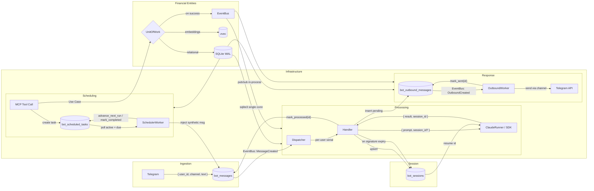

### Dataflow Summary

| Path                           | Input                                       | Transform                                                       | Output                                                |
| ------------------------------ | ------------------------------------------- | --------------------------------------------------------------- | ----------------------------------------------------- |
| User → bot_messages            | `{ user_id: str, channel: str, text: str }` | INSERT with `status='pending'` + EventBus.emit(MessageCreated)  | `{ id: int, status: 'pending', created_at: str }`     |
| MessageCreated → Dispatcher    | Event: `{ message_id: int, user_id: str }`  | Route to per-user queue, invoke ClaudeRunner                    | `{ result: str, session_id: str }`                    |
| Handler → bot_outbound         | `{ user_id, text, sender }`                 | INSERT with `status='pending'` + EventBus.emit(OutboundCreated) | `{ id, status: 'pending' }`                           |
| OutboundCreated → Worker       | Event: `{ outbound_id: int, user_id: str }` | Resolve channel handler, send                                   | `{ status: 'sent' }` or `{ status: 'failed', error }` |
| MCP → Use Case → UoW           | `{ user_id, data, embedding? }`             | SQLite write + zvec write (if embedding) + emit events          | `{ model }`                                           |
| MCP → scheduled_tasks          | `{ prompt, schedule_type, schedule_value }` | INSERT with `status='active'` via UoW                           | `{ id, next_run_at: str }`                            |
| SchedulerWorker → bot_messages | `{ user_id, prompt }`                       | Inject synthetic message via UoW + emit MessageCreated          | Re-enters Processing pipeline                         |

---

## 1. Event Bus

In-process pub/sub.

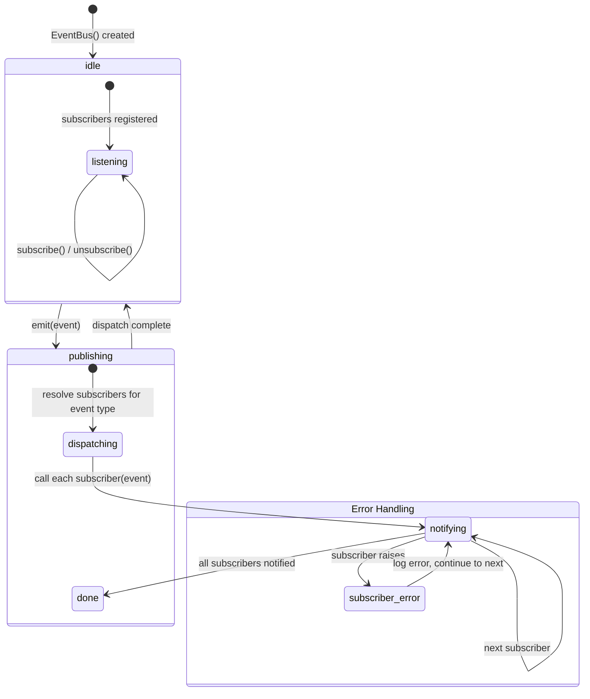

### Event Types

| Event                  | Trigger                       | Fields                               | Subscribers                    |
| ---------------------- | ----------------------------- | ------------------------------------ | ------------------------------ |
| `MessageCreated`       | bot_messages INSERT           | `message_id: int, user_id: str`      | Dispatcher (via Poller notify) |
| `OutboundCreated`      | bot_outbound INSERT           | `outbound_id: int, user_id: str`     | OutboundWorker (via notify)    |
| `TransactionCreated`   | UoW commit                    | `transaction_id: str, user_id: str`  | (future)                       |
| `TransactionUpdated`   | UoW commit                    | `transaction_id: str, user_id: str`  | (future)                       |
| `TransactionDeleted`   | UoW commit                    | `transaction_id: str, user_id: str`  | (future)                       |
| `MemoryCreated`        | UoW commit                    | `memory_id: str, user_id: str`       | (future)                       |
| `SubscriptionCreated`  | UoW commit                    | `subscription_id: str, user_id: str` | (future)                       |
| `SavingsCreated`       | UoW commit                    | `savings_id: str, user_id: str`      | (future)                       |
| `ScheduledTaskCreated` | UoW commit                    | `task_id: int, user_id: str`         | (future)                       |
| `ScheduledTaskDue`     | _(not emitted — placeholder)_ | `task_id: int, user_id: str`         | (future)                       |

### Design Decisions

- Subscribers are `async` callables
- One subscriber failure doesn't block others (error logged via `structlog`, continues)
- No persistence — fire-and-forget in-process signals
- No ordering guarantees between subscribers of the same event
- Thread-safe via asyncio (all emit/subscribe on the event loop)
- `unsubscribe()` supported but not currently used in production code
- No shutdown/drain mechanism — EventBus is a singleton with no lifecycle cleanup
- No retry or deadletter queue — failed event processing is lost for that subscriber

---

## 2. Unit of Work

Dual-write coordinator for SQLite + zvec with event emission.

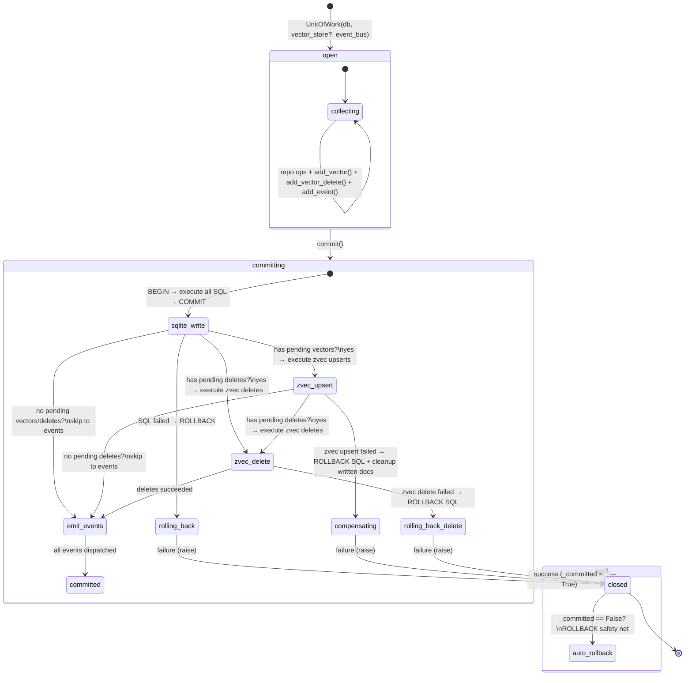

### Pending Buffers

The UoW maintains three separate pending buffers, all cleared on `__aenter__`:

| Buffer             | Method                                                | Contents                           |
| ------------------ | ----------------------------------------------------- | ---------------------------------- |
| `_pending_vectors` | `add_vector(collection, doc_id, embedding, metadata)` | Upsert operations for zvec         |
| `_pending_deletes` | `add_vector_delete(collection, doc_id)`               | Delete operations for zvec         |
| `_pending_events`  | `add_event(event)`                                    | Domain events to emit after commit |

### Transition Table

| Transition                    | Trigger                                                                             | Side Effects                                                                                                                                                                                   |
| ----------------------------- | ----------------------------------------------------------------------------------- | ---------------------------------------------------------------------------------------------------------------------------------------------------------------------------------------------- |
| `[*] → open`                  | `async with uow:` (`__aenter__`)                                                    | SQLite `BEGIN` via explicit `conn.execute("BEGIN")`. Repos bound to UoW's connection. Pending buffers cleared. `_committed` set to `False`.                                                    |
| `collecting → collecting`     | `repo.create(model)`, `add_vector(...)`, `add_vector_delete(...)`, `add_event(...)` | SQL executes against the open transaction. Vector ops and events buffered (no I/O yet).                                                                                                        |
| `open → committing`           | `uow.commit()`                                                                      | Starts the commit sequence.                                                                                                                                                                    |
| `sqlite_write`                | Execute all SQL in transaction                                                      | `conn.commit()` the SQLite transaction. `_committed = True`.                                                                                                                                   |
| `zvec_upsert`                 | Execute all zvec upserts                                                            | `collection.upsert(doc)` for each pending vector. Tracks `written_vectors` for potential compensation.                                                                                         |
| `zvec_delete`                 | Execute all zvec deletes                                                            | `collection.delete(doc_id)` for each pending delete.                                                                                                                                           |
| `emit_events`                 | Emit domain events                                                                  | `event_bus.emit(event)` for each pending event.                                                                                                                                                |
| `zvec_upsert → compensating`  | zvec upsert raises                                                                  | Call `_compensate_zvec()`: attempt `collection.delete(id)` for each already-written doc. **Compensation failures are silently logged** — partial inconsistency possible. Raise original error. |
| `zvec_delete → rolling_back`  | zvec delete raises                                                                  | `conn.rollback()`. Raise original error.                                                                                                                                                       |
| `sqlite_write → rolling_back` | SQL raises                                                                          | `ROLLBACK`. No zvec writes attempted. Raise original error.                                                                                                                                    |
| `__aexit__`                   | Context manager exit                                                                | If `_committed == False`, execute `conn.rollback()` as safety net.                                                                                                                             |

### Key Invariants

- Events are only emitted after ALL writes (SQLite + zvec upserts + zvec deletes) succeed. Consumers never see partial state.
- SQLite uses `isolation_level=None` (autocommit mode), so UoW must explicitly `BEGIN`/`COMMIT`.
- Compensation for failed zvec writes is best-effort — `_compensate_zvec()` catches and logs exceptions per doc, meaning partial compensation can leave zvec inconsistent.

---

## 3. Database Connection

SQLite via `sqlite3` with a single shared connection.

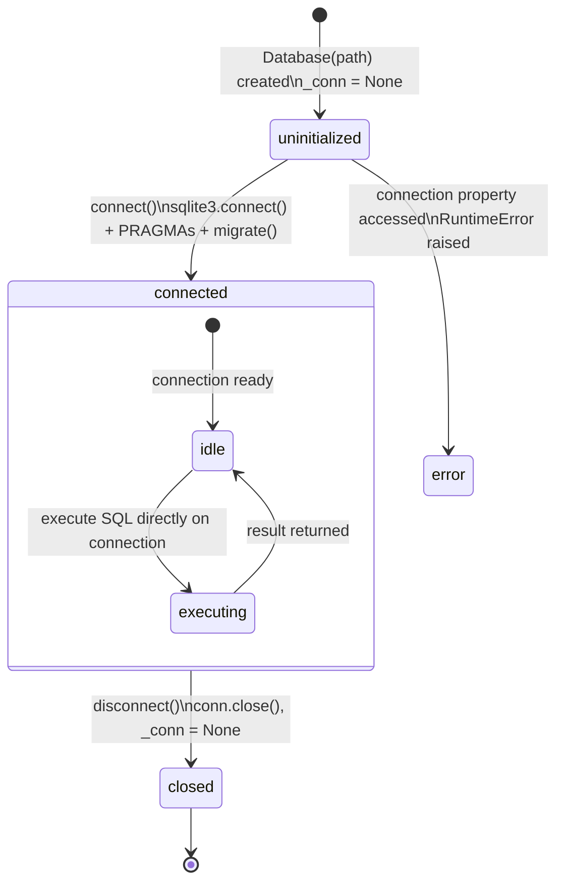

### Transition Table

| Transition                  | Trigger                              | Side Effects                                                                                                                                                                                                                             |
| --------------------------- | ------------------------------------ | ---------------------------------------------------------------------------------------------------------------------------------------------------------------------------------------------------------------------------------------- |
| `[*] → uninitialized`       | `Database(path)`                     | Path stored. `_conn = None`. No connection yet.                                                                                                                                                                                          |
| `uninitialized → connected` | `connect()`                          | `sqlite3.connect(path, check_same_thread=False, isolation_level=None)`. PRAGMAs: `journal_mode=WAL`, `foreign_keys=ON`, `busy_timeout=5000`, `synchronous=NORMAL`, `cache_size=-8000`, `wal_autocheckpoint=1000`. Then runs `migrate()`. |
| `uninitialized → error`     | `.connection` property               | Raises `RuntimeError("Database not connected. Call connect() first.")`                                                                                                                                                                   |
| `idle → executing`          | Direct SQL execution on `self._conn` | Single connection, no pooling, no ThreadPoolExecutor. All callers share the same `sqlite3.Connection`.                                                                                                                                   |
| `connected → closed`        | `disconnect()`                       | `conn.close()`, `_conn = None`. Idempotent (checks `if self._conn` first).                                                                                                                                                               |

### Configuration Details

| PRAGMA               | Value               | Purpose                                                          |
| -------------------- | ------------------- | ---------------------------------------------------------------- |
| `journal_mode`       | `WAL`               | Concurrent reads with serialized writes                          |
| `foreign_keys`       | `ON`                | Enforce FK constraints                                           |
| `busy_timeout`       | `5000` (ms)         | Wait up to 5s for locks before SQLITE_BUSY                       |
| `synchronous`        | `NORMAL`            | Balanced durability/performance for WAL mode                     |
| `cache_size`         | `-8000` (8 MB)      | Page cache size                                                  |
| `wal_autocheckpoint` | `1000` (frames)     | Checkpoint WAL after 1000 frames                                 |
| `isolation_level`    | `None` (autocommit) | Application manages transactions explicitly via `BEGIN`/`COMMIT` |

### Instances

| Component  | Init Strategy                                  |
| ---------- | ---------------------------------------------- |
| API Server | Lazy on first request                          |
| MCP Server | Lazy on first tool call                        |
| Agent Bot  | Eager on startup                               |
| Entrypoint | Shared singleton via `infrastructure.get_db()` |

### Migration System

Migrations run automatically during `connect()` via `migrate()`:

1. Check/create `schema_migrations` table with `version INTEGER`
2. Read current version (0 if no rows)
3. Apply each migration file (sorted by filename) where version > current
4. Each migration runs in its own transaction
5. **Append-only** — no rollback/down-migration support
6. Partial failure: transaction rolled back, version not recorded, next `connect()` retries

---

## 4. Inbound Message Pipeline

Messages from external channels flow through event-driven dispatch, queuing, and processing.

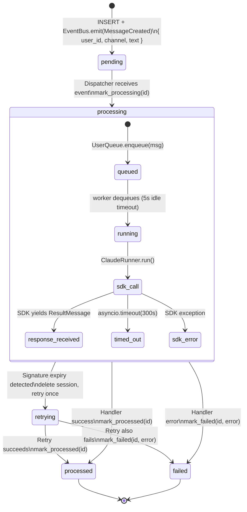

### Transition Table

| Transition               | Trigger                                    | Input Schema                                                                     | Side Effects                                                                                                                                           | Output Schema                                             |
| ------------------------ | ------------------------------------------ | -------------------------------------------------------------------------------- | ------------------------------------------------------------------------------------------------------------------------------------------------------ | --------------------------------------------------------- |
| `[*] → pending`          | Channel handler (Telegram)                 | `{ user_id: str, channel: str, platform_id: str, text: str?, image_path: str? }` | INSERT into `bot_messages` via UoW. EventBus emits `MessageCreated`.                                                                                   | `{ id: int, status: 'pending', created_at: str }`         |
| `pending → processing`   | Dispatcher receives `MessageCreated` event | `{ message_id: int, user_id: str }`                                              | UPDATE `status='processing'`                                                                                                                           | `{ id, status: 'processing' }`                            |
| `processing → processed` | Handler completes successfully             | `{ id: int }`                                                                    | UPDATE `status='processed'`, `processed_at`. May INSERT into `bot_outbound_messages` + emit `OutboundCreated`. May upsert `bot_sessions`. All via UoW. | `{ id, status: 'processed', processed_at: str }`          |
| `processing → retrying`  | Signature expiry or exit code 1            | `{ id: int, error: str }`                                                        | `session_repo.delete(user_id)`. Re-invoke `ClaudeRunner.run(session_id=None)`. **One retry only.**                                                     | (retrying with fresh session)                             |
| `retrying → processed`   | Retry succeeds                             | `{ id: int }`                                                                    | Same as `processing → processed`.                                                                                                                      | `{ id, status: 'processed' }`                             |
| `retrying → failed`      | Retry also fails                           | `{ id: int, error: str }`                                                        | UPDATE `status='failed'`, `error`, `processed_at`.                                                                                                     | `{ id, status: 'failed', error: str }`                    |
| `processing → failed`    | Handler raises or SDK errors               | `{ id: int, error: str }`                                                        | UPDATE `status='failed'`, `error`, `processed_at`. May notify user/admin depending on error class.                                                     | `{ id, status: 'failed', error: str, processed_at: str }` |

### Error Classification

The handler classifies SDK errors and sends targeted notifications:

| Error Pattern        | Matches                                                                                | User Notification                              | Admin Notification                                            |
| -------------------- | -------------------------------------------------------------------------------------- | ---------------------------------------------- | ------------------------------------------------------------- |
| Usage/context limits | `max_tokens`, `context window`, `token limit`, `rate limit`, `quota`, `credit balance` | "I hit an AI usage/context limit..."           | No                                                            |
| Authentication       | `authentication_error`, `401`, `invalid token`, `token expired`                        | "I'm temporarily unavailable..."               | Yes (throttled: 1 notification per hour) + refresh-token hint |
| SDK exit code        | `command failed with exit code 1` + stderr                                             | "I couldn't complete due to upstream error..." | No                                                            |
| Signature expiry     | `Invalid signature in thinking block`, `exit code 1`                                   | No (automatic retry)                           | No                                                            |
| Other errors         | (catch-all)                                                                            | No                                             | No                                                            |

### Dataflow: Processing Phase

```
EventBus emits MessageCreated { message_id, user_id }
        │
        ▼
Dispatcher subscribes → routes to UserQueue by user_id
        │
        ▼
    ┌─ UserQueue.enqueue(msg) ─┐
    │  route by user_id        │
    │  worker exits after 5s   │
    │  idle (auto-cleanup)     │
    └──────────┬───────────────┘
               ▼
    ┌─ ClaudeRunner.run() ─────────────────────┐
    │  system_prompt: str (enriched w/ profile) │
    │  mcp_config: { --user-id injected }       │
    │  session_id: str? (from bot_sessions)     │
    └──────────┬───────────────────────────────┘
               ▼
    SDK yields: SystemMessage { data.session_id }
                ResultMessage { result, session_id, is_error }
               │
               ▼
    ┌─ Response routing (via UoW) ───────────────┐
    │  success → insert outbound + mark_processed │
    │  error   → classify + notify + mark_failed  │
    │  expiry  → delete session + retry once      │
    │  session → upsert bot_sessions              │
    │  events  → OutboundCreated emitted          │
    └─────────────────────────────────────────────┘
```

### Exception Safety

- Handler exceptions do **not** crash the UserQueue — caught, logged, queue continues
- Per-user queues are serial (one message at a time), parallel across users
- Worker tasks auto-cleanup after 5s idle (no persistent threads per user)

---

## 5. Outbound Message Delivery

Responses queued for delivery to external channels.

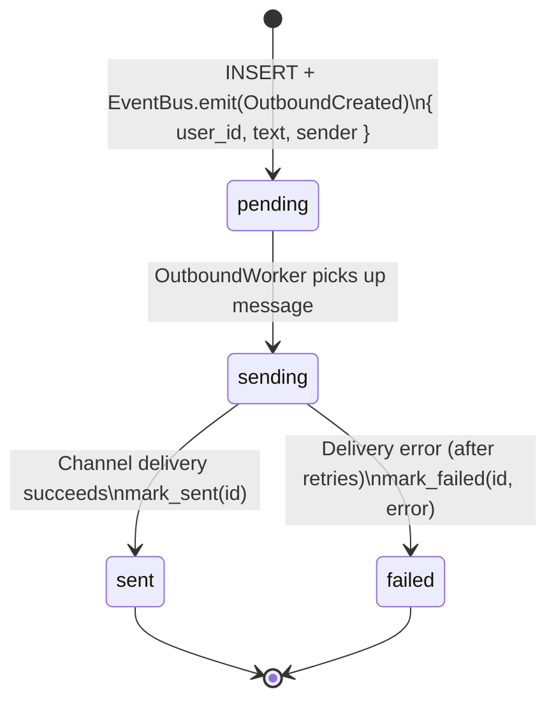

### Transition Table

| Transition          | Trigger                                         | Input Schema                                | Side Effects                                                                                                                                  | Output Schema                                             |
| ------------------- | ----------------------------------------------- | ------------------------------------------- | --------------------------------------------------------------------------------------------------------------------------------------------- | --------------------------------------------------------- |
| `[*] → pending`     | Handler inserts response via UoW                | `{ user_id: str, text: str, sender: str? }` | INSERT into `bot_outbound_messages`. EventBus emits `OutboundCreated`.                                                                        | `{ id: int, status: 'pending', created_at: str }`         |
| `pending → sending` | OutboundWorker receives `OutboundCreated` event | `{ outbound_id: int, user_id: str }`        | Parse `user_id` → `(channel, platform_id)`. Look up channel handler.                                                                          | —                                                         |
| `sending → sent`    | Channel delivery succeeds                       | `{ id: int }`                               | `channel.send_message(platform_id, text)`. UPDATE `status='sent'`, `completed_at`.                                                            | `{ id, status: 'sent', completed_at: str }`               |
| `sending → failed`  | Channel send raises (after retries)             | `{ id: int, error: str }`                   | UPDATE `status='failed'`, `error`, `completed_at`.                                                                                            | `{ id, status: 'failed', error: str, completed_at: str }` |
| `sending → failed`  | Unknown channel prefix                          | `{ id: int }`                               | No matching channel handler for user_id prefix (e.g., `slack:` when only `tg:` registered). Mark failed with "No channel handler for prefix". | `{ id, status: 'failed', error: str }`                    |

### Telegram Delivery Details

The Telegram channel handler has additional delivery logic not captured in the state machine:

**Message chunking**: Telegram API has a 4096-character limit. Messages exceeding this are split into chunks, each sent independently.

**Retry with exponential backoff** (`_send_with_retry`):

- 3 attempts total per chunk
- Backoff: 1s → 2s → 4s
- Retries only on transient errors: `TimedOut`, `NetworkError`
- Other exceptions (e.g., `HTTPError`) propagate immediately

**Image validation** (inbound, before processing):

- Max size: 10 MB
- Allowed formats: JPEG (magic bytes `\xff\xd8\xff`), PNG (magic bytes `\x89PNG\r\n\x1a\n`)
- Invalid images: log warning, delete file, set `image_path=None`, continue without image

**Delivery failure notification**: If `send_message()` fails, handler attempts to send a fallback error message to the user ("I got a response but couldn't send it due to a network issue..."). If that also fails, log and move on.

---

## 6. Scheduled Tasks

Timed task execution for recurring financial operations.

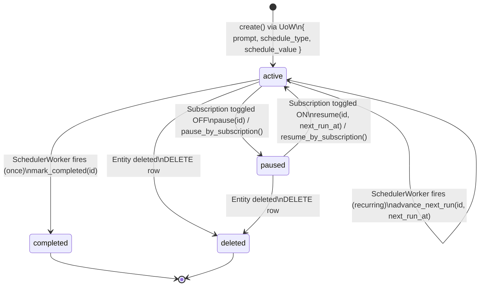

### Transition Table

| Transition           | Trigger                                            | Input Schema                                                                                                                           | Side Effects                                                                                                                                        | Output Schema                                     |
| -------------------- | -------------------------------------------------- | -------------------------------------------------------------------------------------------------------------------------------------- | --------------------------------------------------------------------------------------------------------------------------------------------------- | ------------------------------------------------- |
| `[*] → active`       | Use case creates subscription/savings via UoW      | `{ user_id: str, prompt: str, schedule_type: 'once'\|'cron'\|'interval', schedule_value: str, subscription_id?: str, asset_id?: str }` | INSERT into `bot_scheduled_tasks` with `status='active'`, computed `next_run_at`.                                                                   | `{ id: int, status: 'active', next_run_at: str }` |
| `active → active`    | `SchedulerWorker._fire_task()` (recurring)         | `{ id: int, schedule_type: 'cron', schedule_value: str }`                                                                              | 1. INSERT synthetic `bot_message` via UoW + emit MessageCreated. 2. Compute next occurrence via `croniter`. 3. UPDATE `next_run_at`, `last_run_at`. | `{ id, next_run_at: str, last_run_at: str }`      |
| `active → completed` | `SchedulerWorker._fire_task()` (one-shot)          | `{ id: int, schedule_type: 'once' }`                                                                                                   | 1. INSERT synthetic `bot_message` via UoW + emit MessageCreated. 2. UPDATE `status='completed'`, `last_run_at`.                                     | `{ id, status: 'completed', last_run_at: str }`   |
| `active → paused`    | `ToggleSubscription` use case sets `active=false`  | `{ subscription_id: str }`                                                                                                             | UPDATE `status='paused'` WHERE `subscription_id` matches. Via UoW. Also available via `pause_by_asset()`.                                           | `{ id, status: 'paused' }`                        |
| `paused → active`    | `ToggleSubscription` use case sets `active=true`   | `{ subscription_id: str, next_run_at: str }`                                                                                           | UPDATE `status='active'`, `next_run_at` recomputed. Via UoW. Also available via `resume_by_asset()`.                                                | `{ id, status: 'active', next_run_at: str }`      |
| `* → deleted`        | Entity (subscription/savings) deleted via use case | `{ subscription_id?: str, asset_id?: str }`                                                                                            | DELETE FROM `bot_scheduled_tasks`. Via UoW. Also available via `delete_by_asset()`.                                                                 | (row removed)                                     |

### Failure Handling

- **No error/retry status**: If `_fire_task()` fails (e.g., message injection raises), the exception is logged and the task remains in `active` status. It will be retried on the next scheduler poll cycle.
- **Savings tasks use `schedule_type='once'`**: After each interest processing, `ProcessInterest` creates a **new** task row for the next interest date (rather than advancing `next_run_at` on the existing row). Old task is marked `completed`.

### Dataflow: Cron Computation

```
Subscription { cycle: 'monthly', next_date: '2026-04-15' }
        │
        ▼
_derive_cron(cycle, next_date)
        │  monthly → "0 0 {day} * *" → "0 0 15 * *"
        │  yearly  → "0 0 {day} {month} *" → "0 0 15 4 *"
        ▼
croniter("0 0 15 * *", now_in_user_tz).get_next(datetime)
        │
        ▼
next_run_at = result.isoformat()  →  stored in SQLite
```

---

## 7. Subscription Lifecycle

Full lifecycle of a recurring subscription with paired scheduler.

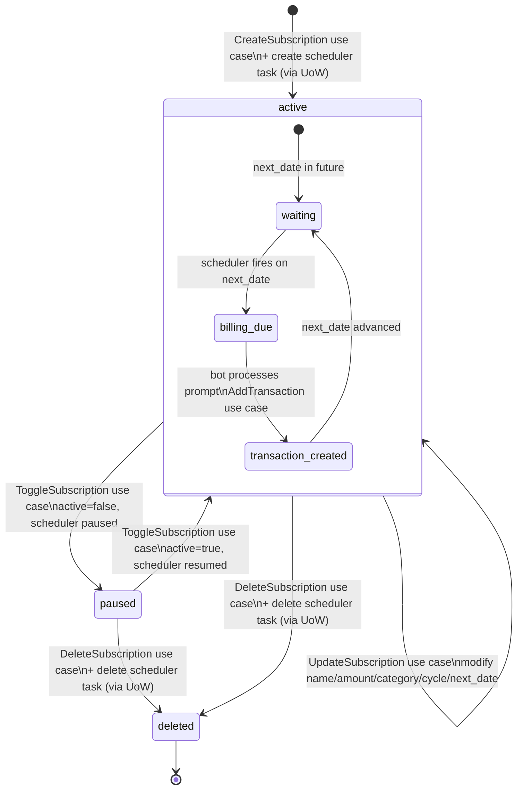

### Transition Table

| Transition                          | Trigger                                    | Input Schema                                                                                                       | Side Effects                                                                                                                                                   | Output Schema                                                       |
| ----------------------------------- | ------------------------------------------ | ------------------------------------------------------------------------------------------------------------------ | -------------------------------------------------------------------------------------------------------------------------------------------------------------- | ------------------------------------------------------------------- |
| `[*] → active`                      | `CreateSubscription` use case              | `{ user_id: str, name: str, amount: Decimal, category: str, billing_cycle: 'monthly'\|'yearly', next_date: date }` | 1. INSERT `subscriptions`. 2. INSERT `bot_scheduled_tasks` (type='cron', paired via `subscription_id`). Both via UoW. Emits `SubscriptionCreated`.             | `{ id: str, name, amount, billing_cycle, next_date, active: true }` |
| `active → active`                   | `UpdateSubscription` use case              | `{ subscription_id: str, name?: str, amount?: Decimal, category?: str, billing_cycle?: str, next_date?: date }`    | UPDATE `subscriptions` with provided fields. If `billing_cycle` or `next_date` changed, recompute scheduler's `schedule_value` and `next_run_at`. Via UoW.     | `{ id, ...updated_fields }`                                         |
| `active → paused`                   | `ToggleSubscription` when currently active | `{ subscription_id: str }`                                                                                         | 1. UPDATE `subscriptions.active = 0`. 2. UPDATE `bot_scheduled_tasks.status = 'paused'`. Via UoW.                                                              | `{ id, active: false }`                                             |
| `paused → active`                   | `ToggleSubscription` when currently paused | `{ subscription_id: str }`                                                                                         | 1. UPDATE `subscriptions.active = 1`. 2. UPDATE `bot_scheduled_tasks.status = 'active'`, recompute `next_run_at`. Via UoW.                                     | `{ id, active: true }`                                              |
| `* → deleted`                       | `DeleteSubscription` use case              | `{ subscription_id: str, user_id: str }`                                                                           | 1. DELETE `bot_scheduled_tasks` WHERE subscription_id. 2. DELETE `subscriptions` row. **Order matters**: task first, then subscription. Via UoW.               | (rows removed)                                                      |
| `waiting → billing_due`             | Scheduler fires (cron matches)             | `{ task.prompt: str }`                                                                                             | Inject synthetic `bot_message` via UoW + emit MessageCreated.                                                                                                  | `{ bot_message.id: int }`                                           |
| `billing_due → transaction_created` | Bot/Claude processes prompt                | `{ subscription_id: str, amount: Decimal }`                                                                        | `AddTransaction` use case (type='expense'). SQLite + zvec via UoW.                                                                                             | `{ transaction.id: str }`                                           |
| `transaction_created → waiting`     | Scheduler advances                         | `{ task_id: int }`                                                                                                 | `advance_next_run()` with new cron-derived `next_run_at`. UPDATE `subscriptions.next_date` via `advance_next_date()` (monthly: `+1 month`, yearly: `+1 year`). | `{ next_date: str, next_run_at: str }`                              |

### Bidirectional Coupling

Subscription ↔ scheduled task are tightly coupled via `subscription_id` foreign key:

- `CreateSubscription` creates both entities in one UoW transaction
- `ToggleSubscription` updates both entities' status fields
- `DeleteSubscription` deletes task first, then subscription (ordering prevents FK violations)
- If a task is orphaned (subscription deleted outside UoW), scheduler will fire but Claude won't find the subscription

---

## 8. Savings Deposit Lifecycle

Term deposit with compound interest processing and early withdrawal support.

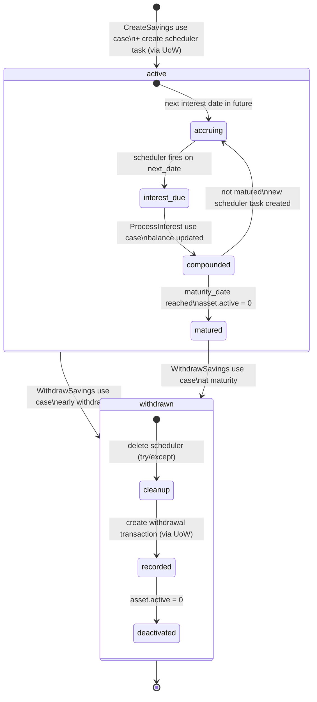

### Transition Table

| Transition                   | Trigger                             | Input Schema                                                                                                                  | Side Effects                                                                                                                                                          | Output Schema                                                       |
| ---------------------------- | ----------------------------------- | ----------------------------------------------------------------------------------------------------------------------------- | --------------------------------------------------------------------------------------------------------------------------------------------------------------------- | ------------------------------------------------------------------- |
| `[*] → active`               | `CreateSavings` use case            | `{ user_id: str, name: str, amount: Decimal, interest_rate: Decimal, frequency: str, start_date: date, maturity_date: date }` | 1. INSERT `assets` (type='savings', active=1). 2. INSERT `bot_scheduled_tasks` (type='once', paired via `asset_id`). Via UoW. Emits `SavingsCreated`.                 | `{ id: str, amount, interest_rate, maturity_date, active: true }`   |
| `accruing → interest_due`    | Scheduler fires (next_date reached) | `{ task.prompt: str, asset_id: str }`                                                                                         | Inject synthetic message via UoW + emit MessageCreated. If matured: append "This deposit matures today...".                                                           | `{ bot_message.id: int }`                                           |
| `interest_due → compounded`  | `ProcessInterest` use case          | `{ asset_id: str, user_id: str }`                                                                                             | Compound interest: `new_balance = amount + interest_earned`. UPDATE `assets.amount`. Via UoW.                                                                         | `{ previous_balance, interest_earned, new_balance, matured: bool }` |
| `compounded → accruing`      | Not matured, re-schedule            | `{ asset_id: str, next_date: date }`                                                                                          | **New** `bot_scheduled_tasks` row (type='once') for next interest date. Old task marked `completed`. Via UoW.                                                         | `{ task.id: int, next_run_at: str }`                                |
| `compounded → matured`       | `maturity_date <= next_date`        | (implicit)                                                                                                                    | `mark_completed()` on scheduler task. `asset_repo.deactivate()` sets `active=0`.                                                                                      | `{ matured: true }`                                                 |
| `active/matured → withdrawn` | `WithdrawSavings` use case          | `{ asset_id: str, user_id: str }`                                                                                             | 1. Delete scheduler (try/except — may not exist if matured). 2. `AddTransaction` (type='income', amount=current_balance). 3. UPDATE `assets.active = 0`. All via UoW. | `{ withdrawn_amount, transaction_id: str }`                         |

### Compound Interest Calculation

**Periodic compounds** (monthly, quarterly, yearly):

```
periods_per_year = { monthly: 12, quarterly: 4, yearly: 1 }
period_rate = rate / periods_per_year
interest_earned = amount * period_rate
new_balance = amount + interest_earned

Example: { amount: 10000, rate: 0.05, frequency: 'monthly' }
  → 10000 * (0.05 / 12) = 41.67
  → new_balance = 10041.67
```

**At-maturity compounds**:

```
interest_earned = amount * rate / 100 / 12 * months_elapsed
new_balance = amount + interest_earned
```

### Savings Task Recreation

Unlike subscription tasks (which use `advance_next_run()`), savings tasks use `schedule_type='once'`. After each `ProcessInterest`, a **new task row** is created for the next interest date. This means the `bot_scheduled_tasks` table accumulates `completed` rows over the savings lifetime.

---

## 9. Claude Session Management

Conversation session tracking with expiry recovery.

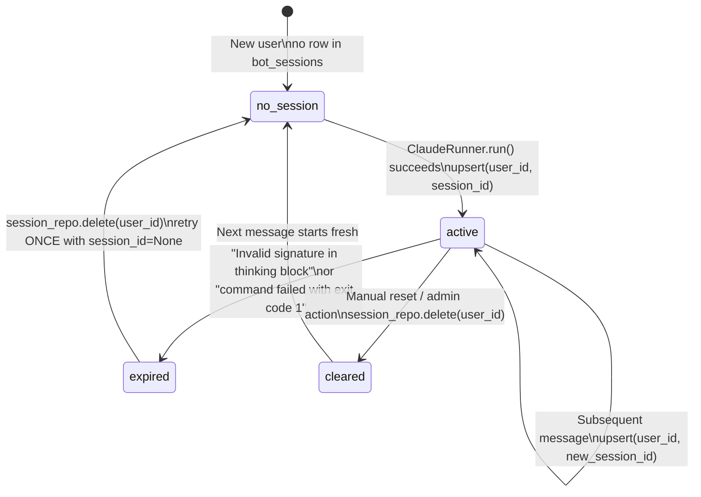

### Transition Table

| Transition             | Trigger                                              | Input Schema                        | Side Effects                                                                                                                                           | Output Schema                              |
| ---------------------- | ---------------------------------------------------- | ----------------------------------- | ------------------------------------------------------------------------------------------------------------------------------------------------------ | ------------------------------------------ |
| `[*] → no_session`     | First message from user                              | `{ user_id: str }`                  | `get_session_id()` returns `None`.                                                                                                                     | `session_id = None`                        |
| `no_session → active`  | SDK returns `ResultMessage`                          | `{ user_id: str, session_id: str }` | `INSERT OR REPLACE INTO bot_sessions (user_id, session_id, updated_at)`. Via UoW.                                                                      | `{ user_id, session_id, updated_at: str }` |
| `active → active`      | Each successful SDK call                             | `{ user_id: str, session_id: str }` | `INSERT OR REPLACE` with new `session_id`. `updated_at` refreshed.                                                                                     | `{ session_id: str, updated_at: str }`     |
| `active → expired`     | SDK error matching `_should_retry_without_session()` | `{ user_id: str, error: str }`      | Matches: "Invalid signature in thinking block" OR "command failed with exit code 1".                                                                   | (error state, about to recover)            |
| `expired → no_session` | Automatic recovery (**one-time retry only**)         | `{ user_id: str }`                  | `DELETE FROM bot_sessions WHERE user_id = ?`. Retry message with `session_id=None`. If retry also fails, message marked `failed` (no further retries). | (row removed, fresh start)                 |
| `active → cleared`     | Manual/admin deletion                                | `{ user_id: str }`                  | `DELETE FROM bot_sessions WHERE user_id = ?`.                                                                                                          | (row removed)                              |

### Dataflow: Session Resolution

```
Incoming message for user_id = "tg:12345"
        │
        ▼
session_repo.get_session_id("tg:12345")
        │
        ├── None → ClaudeRunner.run(session_id=None)
        │          └── SDK starts fresh conversation
        │
        └── "sess_abc123" → ClaudeRunner.run(session_id="sess_abc123")
                            └── SDK resumes conversation
        │
        ▼
SDK yields SystemMessage { data.session_id: "sess_def456" }
SDK yields ResultMessage { session_id: "sess_def456", result: "..." }
        │
        ▼
session_repo.upsert("tg:12345", "sess_def456") via UoW
        └── Next message will resume from "sess_def456"
```

---

## 10. Backup & Restore Lifecycle

Data backup and restoration with safety mechanisms.

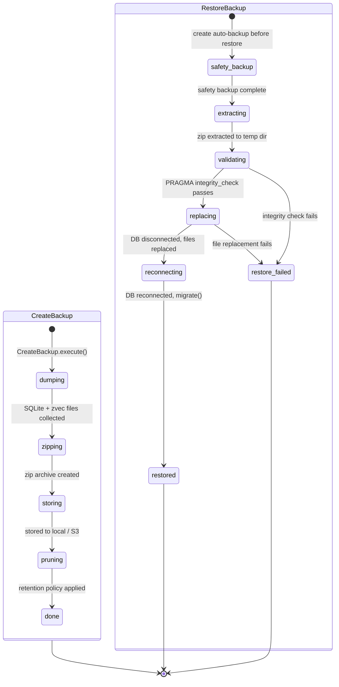

### Transition Table

| Transition                    | Trigger                   | Side Effects                                                                                                           |
| ----------------------------- | ------------------------- | ---------------------------------------------------------------------------------------------------------------------- |
| `[*] → dumping`               | `CreateBackup.execute()`  | Collect SQLite DB file + zvec directories.                                                                             |
| `dumping → zipping`           | Files collected           | Create zip archive with `BackupMetadata` (timestamp, storage type).                                                    |
| `zipping → storing`           | Archive created           | Write to `BACKUP_LOCAL_DIR` or upload to S3.                                                                           |
| `storing → pruning`           | Storage complete          | Apply retention: keep last N backups (local: `BACKUP_LOCAL_RETENTION=7`, S3: `BACKUP_S3_RETENTION=30`). Delete oldest. |
| `[*] → safety_backup`         | `RestoreBackup.execute()` | Create automatic backup of current data before overwriting.                                                            |
| `extracting → validating`     | Zip extracted to temp     | Run `PRAGMA integrity_check` on extracted SQLite file.                                                                 |
| `validating → replacing`      | Integrity OK              | `db.disconnect()`. Replace SQLite file + zvec directories with extracted versions.                                     |
| `replacing → reconnecting`    | Files replaced            | `db.connect()` (re-runs PRAGMAs + `migrate()`).                                                                        |
| `validating → restore_failed` | Integrity check fails     | Raise error. Original data untouched.                                                                                  |
| `replacing → restore_failed`  | File ops fail             | **Partial state possible** — DB may be partially replaced. Safety backup exists for manual recovery.                   |

### Design Decisions

- Restore is **not transactional** — if file replacement fails mid-way, state may be inconsistent
- Safety backup always created before restore as recovery mechanism
- No streaming restore — entire zip must fit in temp storage
- Scheduled backups created during user onboarding (weekly or biweekly cron)

---

## 11. User Onboarding Flow

Telegram conversation-driven setup for new users.

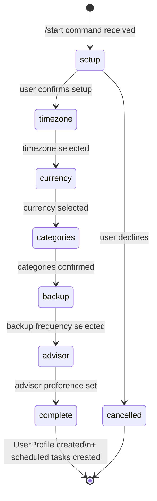

### States

| State        | Prompt                         | User Input                                 | Side Effects                                                                                                          |
| ------------ | ------------------------------ | ------------------------------------------ | --------------------------------------------------------------------------------------------------------------------- |
| `setup`      | Welcome message + setup prompt | Confirm/decline                            | —                                                                                                                     |
| `timezone`   | Timezone selection             | Timezone string (e.g., `Asia/Ho_Chi_Minh`) | —                                                                                                                     |
| `currency`   | Currency selection             | Currency code (e.g., `VND`)                | —                                                                                                                     |
| `categories` | Category customization         | Accept defaults or provide custom list     | —                                                                                                                     |
| `backup`     | Backup frequency               | `weekly` or `biweekly`                     | —                                                                                                                     |
| `advisor`    | Weekly advisor check-in opt-in | Yes/No                                     | —                                                                                                                     |
| `complete`   | Setup confirmation             | —                                          | 1. Create `UserProfile`. 2. Create backup scheduled task (cron). 3. Create advisor check-in task (cron, if opted in). |

### Scheduled Tasks Created

| Task              | Schedule Type | Cron Expression                   | Prompt                                |
| ----------------- | ------------- | --------------------------------- | ------------------------------------- |
| Backup (weekly)   | `cron`        | `0 2 * * 0` (Sunday 2 AM)         | "Create a backup of my data..."       |
| Backup (biweekly) | `cron`        | `0 2 1,15 * *` (1st & 15th, 2 AM) | "Create a backup of my data..."       |
| Advisor check-in  | `cron`        | `0 9 * * 1` (Monday 9 AM)         | "Create a weekly advisor check-in..." |

### Design Decisions

- Onboarding state is **not persisted to database** — lives in Telegram conversation handler state
- If user abandons mid-onboarding, no partial data is saved
- Onboarding can be restarted with `/start`

---

## 12. Worker Lifecycles

Background workers that poll for work and process it.

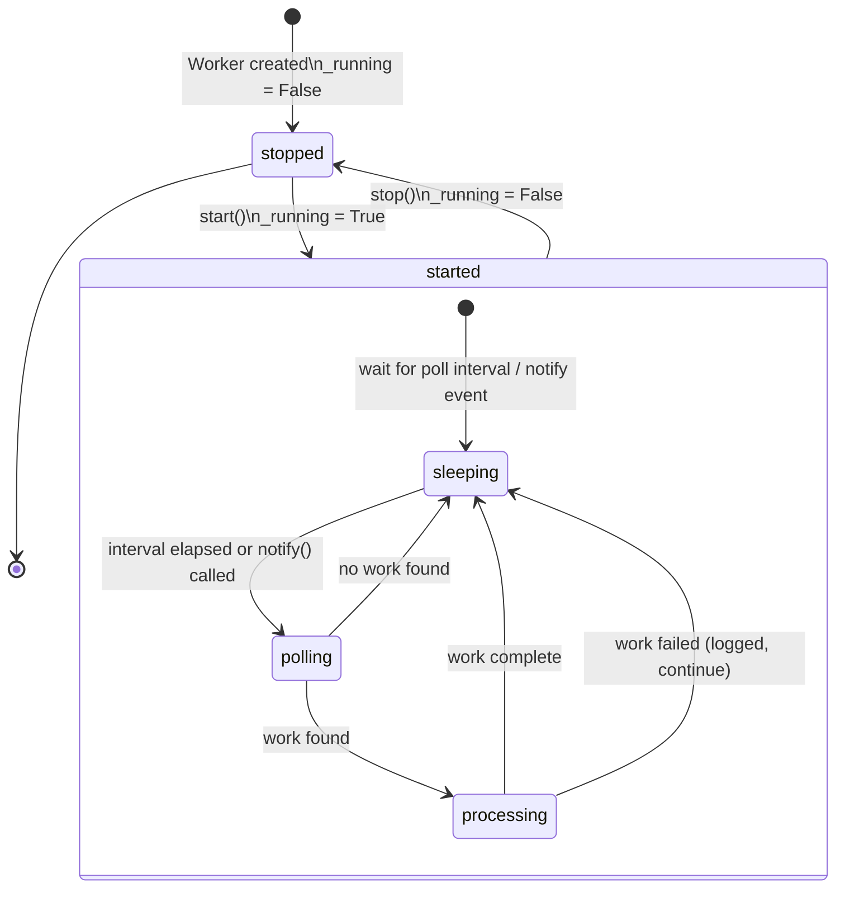

### Worker Configuration

| Worker           | Poll Interval     | Wakeup Mechanism                       | Env Var                  |
| ---------------- | ----------------- | -------------------------------------- | ------------------------ |
| Poller (inbound) | 2.0s              | `asyncio.Event` via `notify()`         | `POLL_INTERVAL`          |
| OutboundWorker   | 2.0s              | `asyncio.Event` via `notify()`         | `POLL_INTERVAL`          |
| SchedulerWorker  | 30.0s             | `asyncio.sleep()` only (no `notify()`) | `FALLBACK_POLL_INTERVAL` |
| UserQueue worker | 5.0s idle timeout | `asyncio.Queue.get()` with timeout     | (hardcoded)              |

### Timing Constants

| Parameter               | Default      | Env Var                  | Purpose                                          |
| ----------------------- | ------------ | ------------------------ | ------------------------------------------------ |
| Inbound poll interval   | 2.0s         | `POLL_INTERVAL`          | Frequency of checking for pending messages       |
| Outbound poll interval  | 2.0s         | `POLL_INTERVAL`          | Frequency of checking for pending outbound       |
| Scheduler poll interval | 30.0s        | `FALLBACK_POLL_INTERVAL` | Frequency of checking for due tasks              |
| UserQueue idle timeout  | 5.0s         | —                        | Time before per-user worker exits if no messages |
| Claude SDK timeout      | 300s (5 min) | `CLAUDE_TIMEOUT`         | Max time for a single SDK invocation             |
| Typing heartbeat        | 4.0s         | —                        | Telegram typing indicator refresh interval       |

### Design Decisions

- Poller and OutboundWorker support `notify()` for immediate wakeup (used by EventBus subscribers)
- SchedulerWorker does **not** support `notify()` — must wait for full poll interval
- Per-user queue workers are created on-demand and auto-cleanup after 5s idle
- All workers catch and log exceptions without crashing — resilient to transient failures
