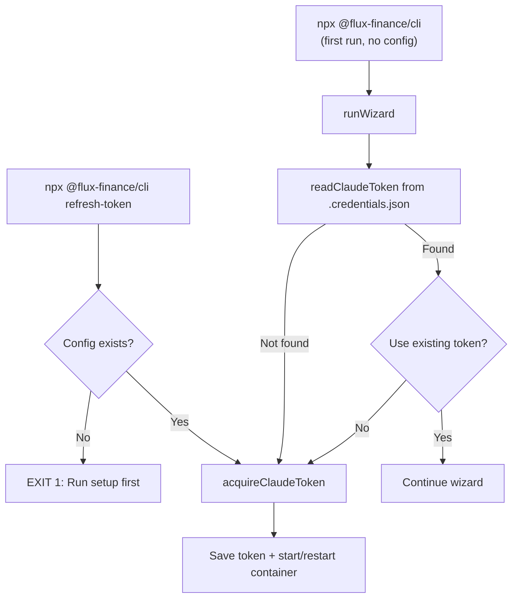
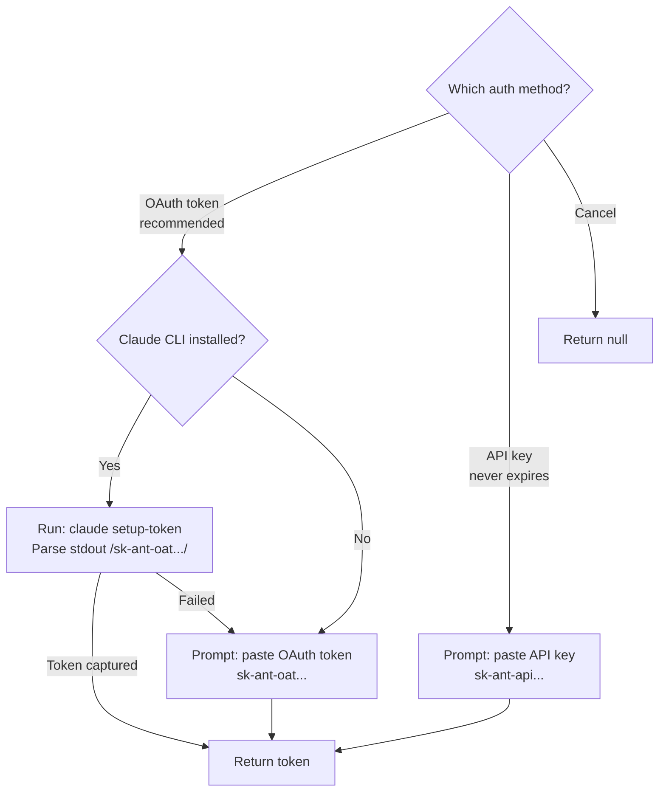
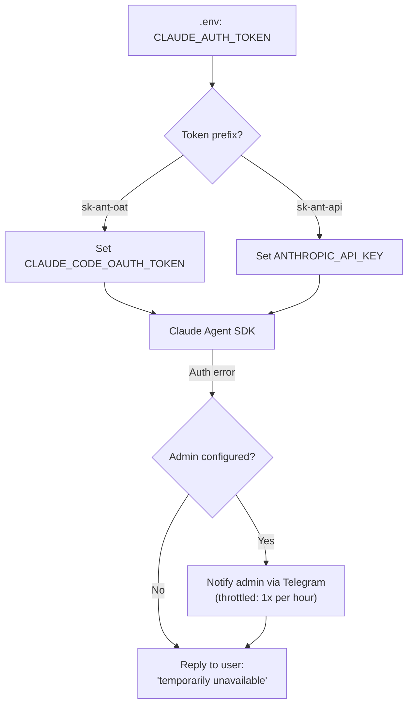

# @flux-finance/cli

Install and manage [FluxFinance](https://github.com/vukhanhtruong/flux) — a personal finance AI agent with Telegram bot and web UI.

## Quick Start

```bash
npx @flux-finance/cli@latest
```

This launches an interactive setup wizard that guides you through everything.

### Prerequisites

- [Docker Desktop](https://docs.docker.com/get-docker/) installed and running
- [Node.js](https://nodejs.org/) 18+

## Setup Wizard

The wizard walks you through:

1. **Docker check** — verifies Docker is installed and running
2. **Claude authentication** — choose OAuth token or API key (see below)
3. **Telegram bot creation** — QR code + step-by-step instructions for [@BotFather](https://t.me/botfather)
4. **Telegram user ID** — QR code + instructions for [@raw_data_bot](https://t.me/raw_data_bot)
5. **Configuration** — Claude model selection and port
6. **Install & start** — pulls the Docker image and starts FluxFinance

## Authentication Flow

The wizard and `refresh-token` command share the same token acquisition flow via `acquireClaudeToken()`.

### 1. Entry Points



### 2. Token Acquisition (`acquireClaudeToken`)



### 3. Inside Docker Container



### Token Types

| Type | Prefix | Expiry | How to get |
| --- | --- | --- | --- |
| OAuth token | `sk-ant-oat` | ~1 year | `claude setup-token` or [console.anthropic.com](https://console.anthropic.com) |
| API key | `sk-ant-api` | Never | [console.anthropic.com/settings/keys](https://console.anthropic.com/settings/keys) |

## Commands

| Command | Description |
| --- | --- |
| `npx @flux-finance/cli` | Run setup wizard (first time) or start FluxFinance |
| `npx @flux-finance/cli start` | Start FluxFinance |
| `npx @flux-finance/cli stop` | Stop FluxFinance |
| `npx @flux-finance/cli status` | Show running status |
| `npx @flux-finance/cli logs` | View container logs |
| `npx @flux-finance/cli update` | Pull latest image and restart |
| `npx @flux-finance/cli config` | Show current configuration |
| `npx @flux-finance/cli refresh-token` | Refresh Claude token without re-running setup |
| `npx @flux-finance/cli ngrok` | Set up remote access via ngrok |
| `npx @flux-finance/cli reset` | Wipe configuration (data is preserved) |

## Configuration

All configuration is stored in `~/.flux-finance/`:

```
~/.flux-finance/
├── .env                 # Credentials and settings
└── data/                # Application data (persisted across updates)
    ├── sqlite/          # Database
    ├── zvec/            # Vector embeddings
    └── backups/         # Backup archives
```

### Environment Variables

| Variable              | Description                              |
| --------------------- | ---------------------------------------- |
| `TELEGRAM_BOT_TOKEN`  | Your Telegram bot token from @BotFather  |
| `TELEGRAM_ALLOW_FROM` | Your Telegram user ID                    |
| `CLAUDE_AUTH_TOKEN`   | Claude authentication token              |
| `CLAUDE_MODEL`        | Claude model ID (default: claude-haiku-4-5-20251001) |
| `FLUX_SECRET_KEY`     | Auto-generated encryption key            |
| `PORT`                | Web UI port (default: 5173)              |
| `NGROK_AUTHTOKEN`     | Optional — ngrok token for remote access |

## Updating

```bash
npx @flux-finance/cli update
```

This pulls the latest Docker image and restarts the container. Your data is preserved.

## Uninstalling

```bash
npx @flux-finance/cli stop
npx @flux-finance/cli reset
```

To also remove your data:

```bash
rm -rf ~/.flux-finance
```

## License

MIT
